<h1>Table of Contents<span class="tocSkip"></span></h1>
<div class="toc"><ul class="toc-item"><li><span><a href="#Data-Visualization:-from-Non-Coder-to-Coder" data-toc-modified-id="Data-Visualization:-from-Non-Coder-to-Coder-1"><span class="toc-item-num">1&nbsp;&nbsp;</span>Data Visualization: from Non-Coder to Coder</a></span></li><li><span><a href="#Hello-Seaborn" data-toc-modified-id="Hello-Seaborn-2"><span class="toc-item-num">2&nbsp;&nbsp;</span>Hello Seaborn</a></span><ul class="toc-item"><li><span><a href="#Load-Data" data-toc-modified-id="Load-Data-2.1"><span class="toc-item-num">2.1&nbsp;&nbsp;</span>Load Data</a></span></li><li><span><a href="#Plot-the-Data" data-toc-modified-id="Plot-the-Data-2.2"><span class="toc-item-num">2.2&nbsp;&nbsp;</span>Plot the Data</a></span></li></ul></li><li><span><a href="#LineCharts" data-toc-modified-id="LineCharts-3"><span class="toc-item-num">3&nbsp;&nbsp;</span>LineCharts</a></span><ul class="toc-item"><li><span><a href="#Load-Data" data-toc-modified-id="Load-Data-3.1"><span class="toc-item-num">3.1&nbsp;&nbsp;</span>Load Data</a></span></li><li><span><a href="#Plot-the-data" data-toc-modified-id="Plot-the-data-3.2"><span class="toc-item-num">3.2&nbsp;&nbsp;</span>Plot the data</a></span></li><li><span><a href="#Plot--a-subset--of-the-data" data-toc-modified-id="Plot--a-subset--of-the-data-3.3"><span class="toc-item-num">3.3&nbsp;&nbsp;</span>Plot  a subset  of the data</a></span></li></ul></li><li><span><a href="#Bar-charts-and-Heatmaps" data-toc-modified-id="Bar-charts-and-Heatmaps-4"><span class="toc-item-num">4&nbsp;&nbsp;</span>Bar charts and Heatmaps</a></span><ul class="toc-item"><li><span><a href="#Laod-Data" data-toc-modified-id="Laod-Data-4.1"><span class="toc-item-num">4.1&nbsp;&nbsp;</span>Laod Data</a></span></li><li><span><a href="#Bar-chart" data-toc-modified-id="Bar-chart-4.2"><span class="toc-item-num">4.2&nbsp;&nbsp;</span>Bar chart</a></span></li><li><span><a href="#Heatmap" data-toc-modified-id="Heatmap-4.3"><span class="toc-item-num">4.3&nbsp;&nbsp;</span>Heatmap</a></span></li></ul></li><li><span><a href="#Scatter" data-toc-modified-id="Scatter-5"><span class="toc-item-num">5&nbsp;&nbsp;</span>Scatter</a></span><ul class="toc-item"><li><span><a href="#Load-Data" data-toc-modified-id="Load-Data-5.1"><span class="toc-item-num">5.1&nbsp;&nbsp;</span>Load Data</a></span></li><li><span><a href="#Plot-the-data" data-toc-modified-id="Plot-the-data-5.2"><span class="toc-item-num">5.2&nbsp;&nbsp;</span>Plot the data</a></span><ul class="toc-item"><li><span><a href="#加入一个回归曲线" data-toc-modified-id="加入一个回归曲线-5.2.1"><span class="toc-item-num">5.2.1&nbsp;&nbsp;</span>加入一个回归曲线</a></span></li><li><span><a href="#散点图着色" data-toc-modified-id="散点图着色-5.2.2"><span class="toc-item-num">5.2.2&nbsp;&nbsp;</span>散点图着色</a></span></li><li><span><a href="#两条回归曲线" data-toc-modified-id="两条回归曲线-5.2.3"><span class="toc-item-num">5.2.3&nbsp;&nbsp;</span>两条回归曲线</a></span></li></ul></li><li><span><a href="#Swarmplot" data-toc-modified-id="Swarmplot-5.3"><span class="toc-item-num">5.3&nbsp;&nbsp;</span>Swarmplot</a></span></li></ul></li><li><span><a href="#histograms-and-density-plots" data-toc-modified-id="histograms-and-density-plots-6"><span class="toc-item-num">6&nbsp;&nbsp;</span>histograms and density plots</a></span><ul class="toc-item"><li><span><a href="#Load-Data" data-toc-modified-id="Load-Data-6.1"><span class="toc-item-num">6.1&nbsp;&nbsp;</span>Load Data</a></span></li><li><span><a href="#Histograms" data-toc-modified-id="Histograms-6.2"><span class="toc-item-num">6.2&nbsp;&nbsp;</span>Histograms</a></span></li><li><span><a href="#kernel-density-estimate-(KDE)-plot" data-toc-modified-id="kernel-density-estimate-(KDE)-plot-6.3"><span class="toc-item-num">6.3&nbsp;&nbsp;</span>kernel density estimate (KDE) plot</a></span></li><li><span><a href="#2D-KDE-Plots" data-toc-modified-id="2D-KDE-Plots-6.4"><span class="toc-item-num">6.4&nbsp;&nbsp;</span>2D-KDE Plots</a></span></li><li><span><a href="#Color-coded-plots" data-toc-modified-id="Color-coded-plots-6.5"><span class="toc-item-num">6.5&nbsp;&nbsp;</span>Color-coded plots</a></span></li></ul></li><li><span><a href="#Changing-styles-with-seaborn" data-toc-modified-id="Changing-styles-with-seaborn-7"><span class="toc-item-num">7&nbsp;&nbsp;</span>Changing styles with seaborn</a></span></li><li><span><a href="#Boxplot-and-violin-plot" data-toc-modified-id="Boxplot-and-violin-plot-8"><span class="toc-item-num">8&nbsp;&nbsp;</span>Boxplot and violin plot</a></span></li><li><span><a href="#Faceting-with-seaborn" data-toc-modified-id="Faceting-with-seaborn-9"><span class="toc-item-num">9&nbsp;&nbsp;</span>Faceting with seaborn</a></span><ul class="toc-item"><li><span><a href="#load-data" data-toc-modified-id="load-data-9.1"><span class="toc-item-num">9.1&nbsp;&nbsp;</span>load data</a></span></li><li><span><a href="#Plot" data-toc-modified-id="Plot-9.2"><span class="toc-item-num">9.2&nbsp;&nbsp;</span>Plot</a></span></li></ul></li><li><span><a href="#pairplot" data-toc-modified-id="pairplot-10"><span class="toc-item-num">10&nbsp;&nbsp;</span>pairplot</a></span></li></ul></div>

# Data Visualization: from Non-Coder to Coder

* 原文link -- https://www.kaggle.com/learn/data-visualization-from-non-coder-to-coder

* 一个 seaborn 画图快速入门

* 进阶---https://www.kaggle.com/residentmario/faceting-with-seaborn/data

# Hello Seaborn


```python
import pandas as pd
import matplotlib.pyplot as plt
import seaborn as sns
```

## Load Data

* 导入 fifa 文件


```python
fifa_filepath = "fifa.csv"

fifa_data = pd.read_csv(fifa_filepath, index_col="Date", parse_dates=True)
```

* index_col :  将 data 列当作索引
* parse_dates ：布尔类型值 or int类型值的列表 or 列表的列表 or 字典（默认值为 FALSE）TRUE：则尝试解析索引


```python
fifa_data.head() # 显示前 5行 
```


<div>
<style scoped>
    .dataframe tbody tr th:only-of-type {
        vertical-align: middle;
    }

    .dataframe tbody tr th {
        vertical-align: top;
    }

    .dataframe thead th {
        text-align: right;
    }
</style>
<table border="1" class="dataframe">
  <thead>
    <tr style="text-align: right;">
      <th></th>
      <th>ARG</th>
      <th>BRA</th>
      <th>ESP</th>
      <th>FRA</th>
      <th>GER</th>
      <th>ITA</th>
    </tr>
    <tr>
      <th>Date</th>
      <th></th>
      <th></th>
      <th></th>
      <th></th>
      <th></th>
      <th></th>
    </tr>
  </thead>
  <tbody>
    <tr>
      <th>1993-08-08</th>
      <td>5.0</td>
      <td>8.0</td>
      <td>13.0</td>
      <td>12.0</td>
      <td>1.0</td>
      <td>2.0</td>
    </tr>
    <tr>
      <th>1993-09-23</th>
      <td>12.0</td>
      <td>1.0</td>
      <td>14.0</td>
      <td>7.0</td>
      <td>5.0</td>
      <td>2.0</td>
    </tr>
    <tr>
      <th>1993-10-22</th>
      <td>9.0</td>
      <td>1.0</td>
      <td>7.0</td>
      <td>14.0</td>
      <td>4.0</td>
      <td>3.0</td>
    </tr>
    <tr>
      <th>1993-11-19</th>
      <td>9.0</td>
      <td>4.0</td>
      <td>7.0</td>
      <td>15.0</td>
      <td>3.0</td>
      <td>1.0</td>
    </tr>
    <tr>
      <th>1993-12-23</th>
      <td>8.0</td>
      <td>3.0</td>
      <td>5.0</td>
      <td>15.0</td>
      <td>1.0</td>
      <td>2.0</td>
    </tr>
  </tbody>
</table>
</div>


读取之后的格式 是 DataFrame
Pandas 数据处理的一种常见的格式


```python
fifa_data['ARG']

```


    Date
    1993-08-08     5.0
    1993-09-23    12.0
    1993-10-22     9.0
    1993-11-19     9.0
    1993-12-23     8.0
    1994-02-15     9.0
    1994-03-15     8.0
    1994-04-19    10.0
    1994-05-17     6.0
    1994-06-14     8.0
    1994-07-21     9.0
    1994-09-13     9.0
    1994-10-25     9.0
    1994-11-22     9.0
    1994-12-20    10.0
    1995-02-20     7.0
    1995-04-19     8.0
    1995-05-16     8.0
    1995-06-13    10.0
    1995-07-25     5.0
    1995-08-22     5.0
    1995-09-19     9.0
    1995-10-17     7.0
    1995-11-21     7.0
    1995-12-19     7.0
    1996-01-24     7.0
    1996-02-21     8.0
    1996-04-24     8.0
    1996-05-22     8.0
    1996-07-03    15.0
                  ... 
    2016-01-07     2.0
    2016-02-04     2.0
    2016-03-03     2.0
    2016-04-07     1.0
    2016-05-05     1.0
    2016-06-02     1.0
    2016-07-14     1.0
    2016-08-11     1.0
    2016-09-15     1.0
    2016-10-20     1.0
    2016-11-24     1.0
    2016-12-22     1.0
    2017-01-12     1.0
    2017-02-09     1.0
    2017-03-09     1.0
    2017-04-06     2.0
    2017-05-04     2.0
    2017-06-01     2.0
    2017-07-06     3.0
    2017-08-10     3.0
    2017-09-14     4.0
    2017-10-16     4.0
    2017-11-23     4.0
    2017-12-21     4.0
    2018-01-18     4.0
    2018-02-15     4.0
    2018-03-15     4.0
    2018-04-12     5.0
    2018-05-17     5.0
    2018-06-07     5.0
    Name: ARG, Length: 286, dtype: float64


## Plot the Data


```python
plt.figure(figsize=(16,6)) 
sns.lineplot(data=fifa_data) 
```


    <matplotlib.axes._subplots.AxesSubplot at 0x11918f630>


* 只需要一个命令就可以画出较为好看的图， Seaborn 真的还是很方便的

# LineCharts

##  Load Data

* The dataset for this tutorial tracks global daily streams on the music streaming service Spotify. We focus on five popular songs from 2017 and 2018


```python
spotify_filepath = "spotify.csv"

spotify_data = pd.read_csv(spotify_filepath, index_col="Date", parse_dates=True)
spotify_data.head()
```


<div>
<style scoped>
    .dataframe tbody tr th:only-of-type {
        vertical-align: middle;
    }

    .dataframe tbody tr th {
        vertical-align: top;
    }

    .dataframe thead th {
        text-align: right;
    }
</style>
<table border="1" class="dataframe">
  <thead>
    <tr style="text-align: right;">
      <th></th>
      <th>Shape of You</th>
      <th>Despacito</th>
      <th>Something Just Like This</th>
      <th>HUMBLE.</th>
      <th>Unforgettable</th>
    </tr>
    <tr>
      <th>Date</th>
      <th></th>
      <th></th>
      <th></th>
      <th></th>
      <th></th>
    </tr>
  </thead>
  <tbody>
    <tr>
      <th>2017-01-06</th>
      <td>12287078</td>
      <td>NaN</td>
      <td>NaN</td>
      <td>NaN</td>
      <td>NaN</td>
    </tr>
    <tr>
      <th>2017-01-07</th>
      <td>13190270</td>
      <td>NaN</td>
      <td>NaN</td>
      <td>NaN</td>
      <td>NaN</td>
    </tr>
    <tr>
      <th>2017-01-08</th>
      <td>13099919</td>
      <td>NaN</td>
      <td>NaN</td>
      <td>NaN</td>
      <td>NaN</td>
    </tr>
    <tr>
      <th>2017-01-09</th>
      <td>14506351</td>
      <td>NaN</td>
      <td>NaN</td>
      <td>NaN</td>
      <td>NaN</td>
    </tr>
    <tr>
      <th>2017-01-10</th>
      <td>14275628</td>
      <td>NaN</td>
      <td>NaN</td>
      <td>NaN</td>
      <td>NaN</td>
    </tr>
  </tbody>
</table>
</div>


* 观察到 除了第一个其他的歌曲数据 都是 NAN，就是没有数据，因为这时候 这些歌曲还没有发行


```python
spotify_data.tail() # 观察最后 5行数据
```


<div>
<style scoped>
    .dataframe tbody tr th:only-of-type {
        vertical-align: middle;
    }

    .dataframe tbody tr th {
        vertical-align: top;
    }

    .dataframe thead th {
        text-align: right;
    }
</style>
<table border="1" class="dataframe">
  <thead>
    <tr style="text-align: right;">
      <th></th>
      <th>Shape of You</th>
      <th>Despacito</th>
      <th>Something Just Like This</th>
      <th>HUMBLE.</th>
      <th>Unforgettable</th>
    </tr>
    <tr>
      <th>Date</th>
      <th></th>
      <th></th>
      <th></th>
      <th></th>
      <th></th>
    </tr>
  </thead>
  <tbody>
    <tr>
      <th>2018-01-05</th>
      <td>4492978</td>
      <td>3450315.0</td>
      <td>2408365.0</td>
      <td>2685857.0</td>
      <td>2869783.0</td>
    </tr>
    <tr>
      <th>2018-01-06</th>
      <td>4416476</td>
      <td>3394284.0</td>
      <td>2188035.0</td>
      <td>2559044.0</td>
      <td>2743748.0</td>
    </tr>
    <tr>
      <th>2018-01-07</th>
      <td>4009104</td>
      <td>3020789.0</td>
      <td>1908129.0</td>
      <td>2350985.0</td>
      <td>2441045.0</td>
    </tr>
    <tr>
      <th>2018-01-08</th>
      <td>4135505</td>
      <td>2755266.0</td>
      <td>2023251.0</td>
      <td>2523265.0</td>
      <td>2622693.0</td>
    </tr>
    <tr>
      <th>2018-01-09</th>
      <td>4168506</td>
      <td>2791601.0</td>
      <td>2058016.0</td>
      <td>2727678.0</td>
      <td>2627334.0</td>
    </tr>
  </tbody>
</table>
</div>


* 观察到 每首歌每天都有 百万量级的 streams

## Plot the data


```python
plt.figure(figsize=(14, 6))
plt.title("Daily Global Streams of Popular Songs in 2017-2018")

sns.lineplot(data=spotify_data)  # 不同于 plot ，一定要有 data
```


    <matplotlib.axes._subplots.AxesSubplot at 0x119bbfb00>


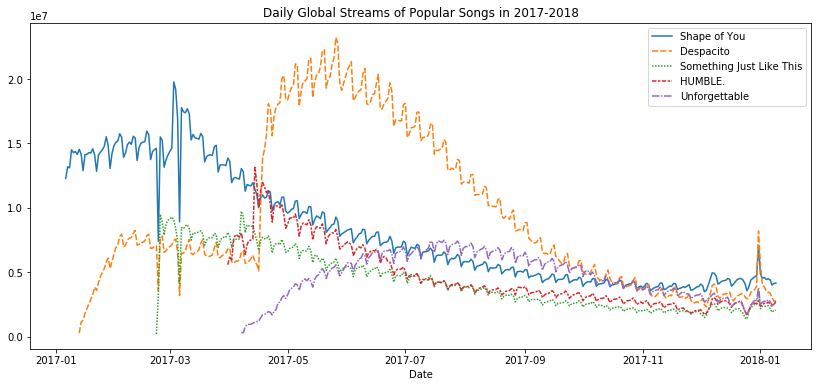


* 观察到默认 添加了legend ，更改坐标轴数据科学表示法，曲线颜色也还ok

## Plot  a subset  of the data

* 只选取 特定几列的数据来画

* DataFrame 数据读取类似于 字典的结构


```python
spotify_data['Shape of You']['2017-01-06']
```


    12287078


```python
spotify_data['Shape of You'][0]
```


    12287078


```python
plt.figure(figsize=(14, 6))
plt.title("Daily Global Streams of Popular Songs in 2017-2018")
plt.xlabel("Date")

sns.lineplot(data=spotify_data['Shape of You'], label="Shape of You")
sns.lineplot(data=spotify_data['Despacito'], label="Despacito")
```


    <matplotlib.axes._subplots.AxesSubplot at 0x119c87a90>


# Bar charts and Heatmaps

## Laod Data

* a dataset from the US Department of Transportation that tracks flight delays.


```python
# Path of the file to read
flight_filepath = "flight_delays.csv"

flight_data = pd.read_csv(flight_filepath, index_col="Month") # 没有添加行标签
flight_data # 数据集较小
```


<div>
<style scoped>
    .dataframe tbody tr th:only-of-type {
        vertical-align: middle;
    }

    .dataframe tbody tr th {
        vertical-align: top;
    }

    .dataframe thead th {
        text-align: right;
    }
</style>
<table border="1" class="dataframe">
  <thead>
    <tr style="text-align: right;">
      <th></th>
      <th>AA</th>
      <th>AS</th>
      <th>B6</th>
      <th>DL</th>
      <th>EV</th>
      <th>F9</th>
      <th>HA</th>
      <th>MQ</th>
      <th>NK</th>
      <th>OO</th>
      <th>UA</th>
      <th>US</th>
      <th>VX</th>
      <th>WN</th>
    </tr>
    <tr>
      <th>Month</th>
      <th></th>
      <th></th>
      <th></th>
      <th></th>
      <th></th>
      <th></th>
      <th></th>
      <th></th>
      <th></th>
      <th></th>
      <th></th>
      <th></th>
      <th></th>
      <th></th>
    </tr>
  </thead>
  <tbody>
    <tr>
      <th>1</th>
      <td>6.955843</td>
      <td>-0.320888</td>
      <td>7.347281</td>
      <td>-2.043847</td>
      <td>8.537497</td>
      <td>18.357238</td>
      <td>3.512640</td>
      <td>18.164974</td>
      <td>11.398054</td>
      <td>10.889894</td>
      <td>6.352729</td>
      <td>3.107457</td>
      <td>1.420702</td>
      <td>3.389466</td>
    </tr>
    <tr>
      <th>2</th>
      <td>7.530204</td>
      <td>-0.782923</td>
      <td>18.657673</td>
      <td>5.614745</td>
      <td>10.417236</td>
      <td>27.424179</td>
      <td>6.029967</td>
      <td>21.301627</td>
      <td>16.474466</td>
      <td>9.588895</td>
      <td>7.260662</td>
      <td>7.114455</td>
      <td>7.784410</td>
      <td>3.501363</td>
    </tr>
    <tr>
      <th>3</th>
      <td>6.693587</td>
      <td>-0.544731</td>
      <td>10.741317</td>
      <td>2.077965</td>
      <td>6.730101</td>
      <td>20.074855</td>
      <td>3.468383</td>
      <td>11.018418</td>
      <td>10.039118</td>
      <td>3.181693</td>
      <td>4.892212</td>
      <td>3.330787</td>
      <td>5.348207</td>
      <td>3.263341</td>
    </tr>
    <tr>
      <th>4</th>
      <td>4.931778</td>
      <td>-3.009003</td>
      <td>2.780105</td>
      <td>0.083343</td>
      <td>4.821253</td>
      <td>12.640440</td>
      <td>0.011022</td>
      <td>5.131228</td>
      <td>8.766224</td>
      <td>3.223796</td>
      <td>4.376092</td>
      <td>2.660290</td>
      <td>0.995507</td>
      <td>2.996399</td>
    </tr>
    <tr>
      <th>5</th>
      <td>5.173878</td>
      <td>-1.716398</td>
      <td>-0.709019</td>
      <td>0.149333</td>
      <td>7.724290</td>
      <td>13.007554</td>
      <td>0.826426</td>
      <td>5.466790</td>
      <td>22.397347</td>
      <td>4.141162</td>
      <td>6.827695</td>
      <td>0.681605</td>
      <td>7.102021</td>
      <td>5.680777</td>
    </tr>
    <tr>
      <th>6</th>
      <td>8.191017</td>
      <td>-0.220621</td>
      <td>5.047155</td>
      <td>4.419594</td>
      <td>13.952793</td>
      <td>19.712951</td>
      <td>0.882786</td>
      <td>9.639323</td>
      <td>35.561501</td>
      <td>8.338477</td>
      <td>16.932663</td>
      <td>5.766296</td>
      <td>5.779415</td>
      <td>10.743462</td>
    </tr>
    <tr>
      <th>7</th>
      <td>3.870440</td>
      <td>0.377408</td>
      <td>5.841454</td>
      <td>1.204862</td>
      <td>6.926421</td>
      <td>14.464543</td>
      <td>2.001586</td>
      <td>3.980289</td>
      <td>14.352382</td>
      <td>6.790333</td>
      <td>10.262551</td>
      <td>NaN</td>
      <td>7.135773</td>
      <td>10.504942</td>
    </tr>
    <tr>
      <th>8</th>
      <td>3.193907</td>
      <td>2.503899</td>
      <td>9.280950</td>
      <td>0.653114</td>
      <td>5.154422</td>
      <td>9.175737</td>
      <td>7.448029</td>
      <td>1.896565</td>
      <td>20.519018</td>
      <td>5.606689</td>
      <td>5.014041</td>
      <td>NaN</td>
      <td>5.106221</td>
      <td>5.532108</td>
    </tr>
    <tr>
      <th>9</th>
      <td>-1.432732</td>
      <td>-1.813800</td>
      <td>3.539154</td>
      <td>-3.703377</td>
      <td>0.851062</td>
      <td>0.978460</td>
      <td>3.696915</td>
      <td>-2.167268</td>
      <td>8.000101</td>
      <td>1.530896</td>
      <td>-1.794265</td>
      <td>NaN</td>
      <td>0.070998</td>
      <td>-1.336260</td>
    </tr>
    <tr>
      <th>10</th>
      <td>-0.580930</td>
      <td>-2.993617</td>
      <td>3.676787</td>
      <td>-5.011516</td>
      <td>2.303760</td>
      <td>0.082127</td>
      <td>0.467074</td>
      <td>-3.735054</td>
      <td>6.810736</td>
      <td>1.750897</td>
      <td>-2.456542</td>
      <td>NaN</td>
      <td>2.254278</td>
      <td>-0.688851</td>
    </tr>
    <tr>
      <th>11</th>
      <td>0.772630</td>
      <td>-1.916516</td>
      <td>1.418299</td>
      <td>-3.175414</td>
      <td>4.415930</td>
      <td>11.164527</td>
      <td>-2.719894</td>
      <td>0.220061</td>
      <td>7.543881</td>
      <td>4.925548</td>
      <td>0.281064</td>
      <td>NaN</td>
      <td>0.116370</td>
      <td>0.995684</td>
    </tr>
    <tr>
      <th>12</th>
      <td>4.149684</td>
      <td>-1.846681</td>
      <td>13.839290</td>
      <td>2.504595</td>
      <td>6.685176</td>
      <td>9.346221</td>
      <td>-1.706475</td>
      <td>0.662486</td>
      <td>12.733123</td>
      <td>10.947612</td>
      <td>7.012079</td>
      <td>NaN</td>
      <td>13.498720</td>
      <td>6.720893</td>
    </tr>
  </tbody>
</table>
</div>


* 这个数据集的 data  不需要通过 parse_dates=True 解析


```python
flight_data["AA"][1]
```


    6.955843432232902


* AA  等 代表不同的 airline code， 

* 正值代表延误的时间 minuts

* 负值代表提前到达

## Bar chart

* 展示 某个 airline 的每个月的平均到达时间


```python
plt.figure(figsize=(10,6))
plt.title("Average Arrival Delay for Spirit Airlines Flights, by Month")

sns.barplot(x=flight_data.index, y=flight_data['AA'])

# x bar 的横坐标
# y bar 的数据

plt.ylabel("Arrival delay (in minutes)")
```


    Text(0,0.5,'Arrival delay (in minutes)')


**注意⚠️**


```python
flight_data.index
```


    Int64Index([1, 2, 3, 4, 5, 6, 7, 8, 9, 10, 11, 12], dtype='int64', name='Month')


```python
flight_data['Month']
```


    ---------------------------------------------------------------------------

    KeyError                                  Traceback (most recent call last)

    ~/anaconda3/envs/tensorflow/lib/python3.6/site-packages/pandas/core/indexes/base.py in get_loc(self, key, method, tolerance)
       3077             try:
    -> 3078                 return self._engine.get_loc(key)
       3079             except KeyError:


    pandas/_libs/index.pyx in pandas._libs.index.IndexEngine.get_loc()


    pandas/_libs/index.pyx in pandas._libs.index.IndexEngine.get_loc()


    pandas/_libs/hashtable_class_helper.pxi in pandas._libs.hashtable.PyObjectHashTable.get_item()


    pandas/_libs/hashtable_class_helper.pxi in pandas._libs.hashtable.PyObjectHashTable.get_item()


    KeyError: 'Month'

    
    During handling of the above exception, another exception occurred:


    KeyError                                  Traceback (most recent call last)

    <ipython-input-53-801fe9fd01da> in <module>()
    ----> 1 flight_data['Month']
    

    ~/anaconda3/envs/tensorflow/lib/python3.6/site-packages/pandas/core/frame.py in __getitem__(self, key)
       2686             return self._getitem_multilevel(key)
       2687         else:
    -> 2688             return self._getitem_column(key)
       2689 
       2690     def _getitem_column(self, key):


    ~/anaconda3/envs/tensorflow/lib/python3.6/site-packages/pandas/core/frame.py in _getitem_column(self, key)
       2693         # get column
       2694         if self.columns.is_unique:
    -> 2695             return self._get_item_cache(key)
       2696 
       2697         # duplicate columns & possible reduce dimensionality


    ~/anaconda3/envs/tensorflow/lib/python3.6/site-packages/pandas/core/generic.py in _get_item_cache(self, item)
       2487         res = cache.get(item)
       2488         if res is None:
    -> 2489             values = self._data.get(item)
       2490             res = self._box_item_values(item, values)
       2491             cache[item] = res


    ~/anaconda3/envs/tensorflow/lib/python3.6/site-packages/pandas/core/internals.py in get(self, item, fastpath)
       4113 
       4114             if not isna(item):
    -> 4115                 loc = self.items.get_loc(item)
       4116             else:
       4117                 indexer = np.arange(len(self.items))[isna(self.items)]


    ~/anaconda3/envs/tensorflow/lib/python3.6/site-packages/pandas/core/indexes/base.py in get_loc(self, key, method, tolerance)
       3078                 return self._engine.get_loc(key)
       3079             except KeyError:
    -> 3080                 return self._engine.get_loc(self._maybe_cast_indexer(key))
       3081 
       3082         indexer = self.get_indexer([key], method=method, tolerance=tolerance)


    pandas/_libs/index.pyx in pandas._libs.index.IndexEngine.get_loc()


    pandas/_libs/index.pyx in pandas._libs.index.IndexEngine.get_loc()


    pandas/_libs/hashtable_class_helper.pxi in pandas._libs.hashtable.PyObjectHashTable.get_item()


    pandas/_libs/hashtable_class_helper.pxi in pandas._libs.hashtable.PyObjectHashTable.get_item()


    KeyError: 'Month'


* 因为 month 那一列被我们用作 每一行的 index。----- index_col="Month"

## Heatmap

* 每个单元都对应于他的数值


```python
# Set the width and height of the figure
plt.figure(figsize=(14, 7))
plt.title("Average Arrival Delay for Each Airline, by Month")

sns.heatmap(data=flight_data, annot=True)
# annot = True 在 热图上面展示数值
plt.xlabel("Airline")
```


    Text(0.5,42,'Airline')


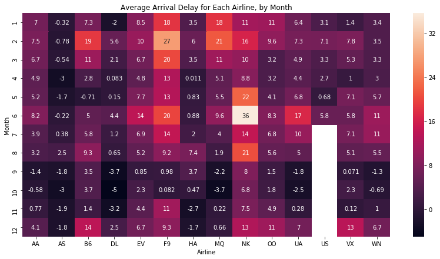


# Scatter
* We'll work with a (synthetic) dataset of insurance charges, to see if we can understand why some customers pay more than others.

## Load Data


```python
insurance_filepath = "insurance.csv"

insurance_data = pd.read_csv(insurance_filepath)
print(insurance_data.shape)
insurance_data.head()
```

    (1338, 7)


<div>
<style scoped>
    .dataframe tbody tr th:only-of-type {
        vertical-align: middle;
    }

    .dataframe tbody tr th {
        vertical-align: top;
    }

    .dataframe thead th {
        text-align: right;
    }
</style>
<table border="1" class="dataframe">
  <thead>
    <tr style="text-align: right;">
      <th></th>
      <th>age</th>
      <th>sex</th>
      <th>bmi</th>
      <th>children</th>
      <th>smoker</th>
      <th>region</th>
      <th>charges</th>
    </tr>
  </thead>
  <tbody>
    <tr>
      <th>0</th>
      <td>19</td>
      <td>female</td>
      <td>27.900</td>
      <td>0</td>
      <td>yes</td>
      <td>southwest</td>
      <td>16884.92400</td>
    </tr>
    <tr>
      <th>1</th>
      <td>18</td>
      <td>male</td>
      <td>33.770</td>
      <td>1</td>
      <td>no</td>
      <td>southeast</td>
      <td>1725.55230</td>
    </tr>
    <tr>
      <th>2</th>
      <td>28</td>
      <td>male</td>
      <td>33.000</td>
      <td>3</td>
      <td>no</td>
      <td>southeast</td>
      <td>4449.46200</td>
    </tr>
    <tr>
      <th>3</th>
      <td>33</td>
      <td>male</td>
      <td>22.705</td>
      <td>0</td>
      <td>no</td>
      <td>northwest</td>
      <td>21984.47061</td>
    </tr>
    <tr>
      <th>4</th>
      <td>32</td>
      <td>male</td>
      <td>28.880</td>
      <td>0</td>
      <td>no</td>
      <td>northwest</td>
      <td>3866.85520</td>
    </tr>
  </tbody>
</table>
</div>


## Plot the data

* 观察 charge 和 BMI(body mass index) 之间的关系


```python
sns.scatterplot(x=insurance_data['bmi'], y=insurance_data['charges'])
```


    <matplotlib.axes._subplots.AxesSubplot at 0x11a833ac8>


* 观察上面的图： 更高的 BMI 支付更高的保险

### 加入一个回归曲线


```python
sns.regplot(x=insurance_data['bmi'], y=insurance_data['charges'])
```

    /Users/liuchuang/anaconda3/envs/tensorflow/lib/python3.6/site-packages/scipy/stats/stats.py:1713: FutureWarning: Using a non-tuple sequence for multidimensional indexing is deprecated; use `arr[tuple(seq)]` instead of `arr[seq]`. In the future this will be interpreted as an array index, `arr[np.array(seq)]`, which will result either in an error or a different result.
      return np.add.reduce(sorted[indexer] * weights, axis=axis) / sumval


    <matplotlib.axes._subplots.AxesSubplot at 0x11aa0aa20>


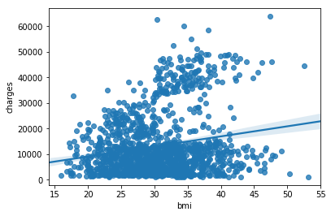


### 散点图着色

* 根据是否吸烟


```python
sns.scatterplot(x=insurance_data['bmi'], y=insurance_data['charges'], hue=insurance_data['smoker'])
```


    <matplotlib.axes._subplots.AxesSubplot at 0x1a1d93f400>


* hue 值 控制该情况下一个嵌套分类的结果

### 两条回归曲线


```python
sns.lmplot(x="bmi", y="charges", hue="smoker", data=insurance_data)
```

    /Users/liuchuang/anaconda3/envs/tensorflow/lib/python3.6/site-packages/scipy/stats/stats.py:1713: FutureWarning: Using a non-tuple sequence for multidimensional indexing is deprecated; use `arr[tuple(seq)]` instead of `arr[seq]`. In the future this will be interpreted as an array index, `arr[np.array(seq)]`, which will result either in an error or a different result.
      return np.add.reduce(sorted[indexer] * weights, axis=axis) / sumval


    <seaborn.axisgrid.FacetGrid at 0x1a1d9ba2e8>


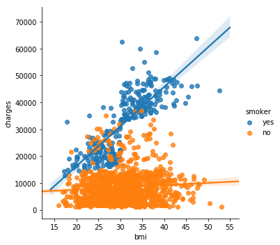


## Swarmplot

* 散点图表示 categorical variable 

* 不一定非要是 连续值

*  between a continuous variable and a categorical variable.


```python
sns.swarmplot(x=insurance_data['smoker'],
              y=insurance_data['charges'])
```


    <matplotlib.axes._subplots.AxesSubplot at 0x1a1d9e8940>


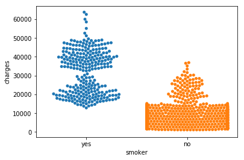


```python
sns.swarmplot(x=insurance_data['children'],
              y=insurance_data['charges'])
```


    <matplotlib.axes._subplots.AxesSubplot at 0x1a1da83eb8>


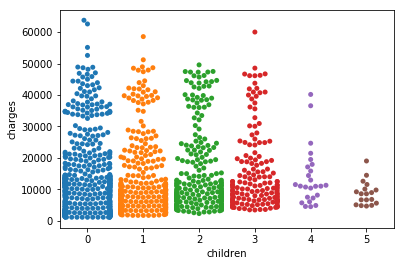


* 还是要坚持国策 hhh


```python
sns.swarmplot(x=insurance_data['sex'],
              y=insurance_data['charges'])
```


    <matplotlib.axes._subplots.AxesSubplot at 0x1a1dc4c5c0>


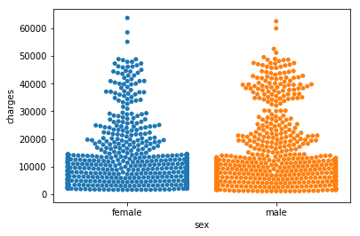


#  histograms and density plots

* iris 数据集

* 150 种花，3 个species： setosa, Iris versicolor, and Iris virginica

## Load Data


```python
iris_filepath = "iris.csv"
iris_data = pd.read_csv(iris_filepath, index_col="Id")
print(iris_data.shape)
iris_data.head()
```

    (150, 5)


<div>
<style scoped>
    .dataframe tbody tr th:only-of-type {
        vertical-align: middle;
    }

    .dataframe tbody tr th {
        vertical-align: top;
    }

    .dataframe thead th {
        text-align: right;
    }
</style>
<table border="1" class="dataframe">
  <thead>
    <tr style="text-align: right;">
      <th></th>
      <th>Sepal Length (cm)</th>
      <th>Sepal Width (cm)</th>
      <th>Petal Length (cm)</th>
      <th>Petal Width (cm)</th>
      <th>Species</th>
    </tr>
    <tr>
      <th>Id</th>
      <th></th>
      <th></th>
      <th></th>
      <th></th>
      <th></th>
    </tr>
  </thead>
  <tbody>
    <tr>
      <th>1</th>
      <td>5.1</td>
      <td>3.5</td>
      <td>1.4</td>
      <td>0.2</td>
      <td>Iris-setosa</td>
    </tr>
    <tr>
      <th>2</th>
      <td>4.9</td>
      <td>3.0</td>
      <td>1.4</td>
      <td>0.2</td>
      <td>Iris-setosa</td>
    </tr>
    <tr>
      <th>3</th>
      <td>4.7</td>
      <td>3.2</td>
      <td>1.3</td>
      <td>0.2</td>
      <td>Iris-setosa</td>
    </tr>
    <tr>
      <th>4</th>
      <td>4.6</td>
      <td>3.1</td>
      <td>1.5</td>
      <td>0.2</td>
      <td>Iris-setosa</td>
    </tr>
    <tr>
      <th>5</th>
      <td>5.0</td>
      <td>3.6</td>
      <td>1.4</td>
      <td>0.2</td>
      <td>Iris-setosa</td>
    </tr>
  </tbody>
</table>
</div>


## Histograms


```python
sns.distplot(a=iris_data['Petal Length (cm)'], kde=False)
```

    /Users/liuchuang/anaconda3/envs/tensorflow/lib/python3.6/site-packages/scipy/stats/stats.py:1713: FutureWarning: Using a non-tuple sequence for multidimensional indexing is deprecated; use `arr[tuple(seq)]` instead of `arr[seq]`. In the future this will be interpreted as an array index, `arr[np.array(seq)]`, which will result either in an error or a different result.
      return np.add.reduce(sorted[indexer] * weights, axis=axis) / sumval


    <matplotlib.axes._subplots.AxesSubplot at 0x1a1dd24b70>


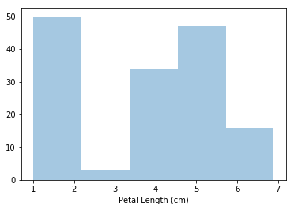


```python
sns.distplot(a=iris_data['Petal Length (cm)'], kde=True)
```

    /Users/liuchuang/anaconda3/envs/tensorflow/lib/python3.6/site-packages/scipy/stats/stats.py:1713: FutureWarning: Using a non-tuple sequence for multidimensional indexing is deprecated; use `arr[tuple(seq)]` instead of `arr[seq]`. In the future this will be interpreted as an array index, `arr[np.array(seq)]`, which will result either in an error or a different result.
      return np.add.reduce(sorted[indexer] * weights, axis=axis) / sumval


    <matplotlib.axes._subplots.AxesSubplot at 0x1a1ddf6780>


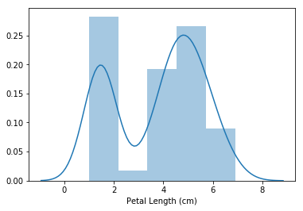


##  kernel density estimate (KDE) plot

* 相当于上面的条形统计图的 平滑的形式

* 或者 就是上面统计图中 kde 曲线的填充


```python
sns.kdeplot(data=iris_data['Petal Length (cm)'], shade=True)
sns.kdeplot(data=iris_data['Sepal Length (cm)'], shade=True)
```


    <matplotlib.axes._subplots.AxesSubplot at 0x1a29808470>


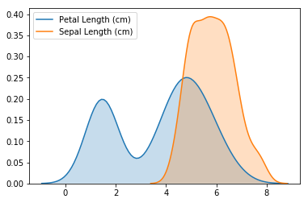


## 2D-KDE Plots


```python
sns.jointplot(x=iris_data['Petal Length (cm)'], y=iris_data['Sepal Width (cm)'], kind="kde")
```


    <seaborn.axisgrid.JointGrid at 0x1a298a3eb8>


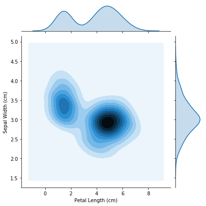


* 颜色越深，这样组合的花 越多

## Color-coded plots

* 读取三种不同花朵的数据


```python
iris_set_filepath = "iris_setosa.csv"
iris_ver_filepath = "iris_versicolor.csv"
iris_vir_filepath = "iris_virginica.csv"

# Read the files into variables
iris_set_data = pd.read_csv(iris_set_filepath, index_col="Id")
iris_ver_data = pd.read_csv(iris_ver_filepath, index_col="Id")
iris_vir_data = pd.read_csv(iris_vir_filepath, index_col="Id")

iris_ver_data.head()
```


<div>
<style scoped>
    .dataframe tbody tr th:only-of-type {
        vertical-align: middle;
    }

    .dataframe tbody tr th {
        vertical-align: top;
    }

    .dataframe thead th {
        text-align: right;
    }
</style>
<table border="1" class="dataframe">
  <thead>
    <tr style="text-align: right;">
      <th></th>
      <th>Sepal Length (cm)</th>
      <th>Sepal Width (cm)</th>
      <th>Petal Length (cm)</th>
      <th>Petal Width (cm)</th>
      <th>Species</th>
    </tr>
    <tr>
      <th>Id</th>
      <th></th>
      <th></th>
      <th></th>
      <th></th>
      <th></th>
    </tr>
  </thead>
  <tbody>
    <tr>
      <th>51</th>
      <td>7.0</td>
      <td>3.2</td>
      <td>4.7</td>
      <td>1.4</td>
      <td>Iris-versicolor</td>
    </tr>
    <tr>
      <th>52</th>
      <td>6.4</td>
      <td>3.2</td>
      <td>4.5</td>
      <td>1.5</td>
      <td>Iris-versicolor</td>
    </tr>
    <tr>
      <th>53</th>
      <td>6.9</td>
      <td>3.1</td>
      <td>4.9</td>
      <td>1.5</td>
      <td>Iris-versicolor</td>
    </tr>
    <tr>
      <th>54</th>
      <td>5.5</td>
      <td>2.3</td>
      <td>4.0</td>
      <td>1.3</td>
      <td>Iris-versicolor</td>
    </tr>
    <tr>
      <th>55</th>
      <td>6.5</td>
      <td>2.8</td>
      <td>4.6</td>
      <td>1.5</td>
      <td>Iris-versicolor</td>
    </tr>
  </tbody>
</table>
</div>


```python
sns.distplot(
    a=iris_set_data['Petal Length (cm)'], label="Iris-setosa", kde=False)
sns.distplot(
    a=iris_ver_data['Petal Length (cm)'], label="Iris-versicolor", kde=False)
sns.distplot(
    a=iris_vir_data['Petal Length (cm)'], label="Iris-virginica", kde=False)

plt.title("Histogram of Petal Lengths, by Species")
plt.legend()
```

    /Users/liuchuang/anaconda3/envs/tensorflow/lib/python3.6/site-packages/scipy/stats/stats.py:1713: FutureWarning: Using a non-tuple sequence for multidimensional indexing is deprecated; use `arr[tuple(seq)]` instead of `arr[seq]`. In the future this will be interpreted as an array index, `arr[np.array(seq)]`, which will result either in an error or a different result.
      return np.add.reduce(sorted[indexer] * weights, axis=axis) / sumval


    <matplotlib.legend.Legend at 0x1a29d83160>


* 不同种类 的petal length 分布


```python
sns.kdeplot(data=iris_set_data['Petal Length (cm)'], label="Iris-setosa", shade=True)
sns.kdeplot(data=iris_ver_data['Petal Length (cm)'], label="Iris-versicolor", shade=True)
sns.kdeplot(data=iris_vir_data['Petal Length (cm)'], label="Iris-virginica", shade=True)
```


    <matplotlib.axes._subplots.AxesSubplot at 0x1a29e43898>


#  Changing styles with seaborn
* 更改绘图格式--背景

> (1)"darkgrid", (2)"whitegrid", (3)"dark", (4)"white", and (5)"ticks"

* 默认 ticks（原文这里有误）


```python
sns.set_style("darkgrid")

# Line chart 
plt.figure(figsize=(12,6))
sns.lineplot(data=spotify_data)
```


    <matplotlib.axes._subplots.AxesSubplot at 0x1a2a8d5978>


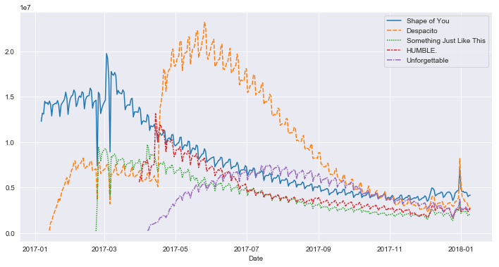


# Boxplot and violin plot


```python
reviews = pd.read_csv(
    "wine-reviews/winemag-data_first150k.csv", index_col=0)
reviews.head(3)
```


<div>
<style scoped>
    .dataframe tbody tr th:only-of-type {
        vertical-align: middle;
    }

    .dataframe tbody tr th {
        vertical-align: top;
    }

    .dataframe thead th {
        text-align: right;
    }
</style>
<table border="1" class="dataframe">
  <thead>
    <tr style="text-align: right;">
      <th></th>
      <th>country</th>
      <th>description</th>
      <th>designation</th>
      <th>points</th>
      <th>price</th>
      <th>province</th>
      <th>region_1</th>
      <th>region_2</th>
      <th>variety</th>
      <th>winery</th>
    </tr>
  </thead>
  <tbody>
    <tr>
      <th>0</th>
      <td>US</td>
      <td>This tremendous 100% varietal wine hails from ...</td>
      <td>Martha's Vineyard</td>
      <td>96</td>
      <td>235.0</td>
      <td>California</td>
      <td>Napa Valley</td>
      <td>Napa</td>
      <td>Cabernet Sauvignon</td>
      <td>Heitz</td>
    </tr>
    <tr>
      <th>1</th>
      <td>Spain</td>
      <td>Ripe aromas of fig, blackberry and cassis are ...</td>
      <td>Carodorum Selección Especial Reserva</td>
      <td>96</td>
      <td>110.0</td>
      <td>Northern Spain</td>
      <td>Toro</td>
      <td>NaN</td>
      <td>Tinta de Toro</td>
      <td>Bodega Carmen Rodríguez</td>
    </tr>
    <tr>
      <th>2</th>
      <td>US</td>
      <td>Mac Watson honors the memory of a wine once ma...</td>
      <td>Special Selected Late Harvest</td>
      <td>96</td>
      <td>90.0</td>
      <td>California</td>
      <td>Knights Valley</td>
      <td>Sonoma</td>
      <td>Sauvignon Blanc</td>
      <td>Macauley</td>
    </tr>
  </tbody>
</table>
</div>


```python
df = reviews[reviews.variety.isin(
    reviews.variety.value_counts().head(5).index)]
# variety 前 5 名酒 的数据
sns.boxplot(x='variety', y='points', data=df)
```


    <matplotlib.axes._subplots.AxesSubplot at 0x1a2ae589e8>


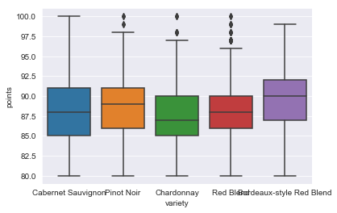


* 中间的箱子有 3条线，上面的是 上四分位数，就是将数据从小到大排列，3/4 while置的数据
* 中间的 是中位数
* 下面的是 下四分位数


```python
sns.violinplot(
    x='variety',
    y='points',
    data=reviews[reviews.variety.isin(reviews.variety.value_counts()[:5].index)]
)
```

    /Users/liuchuang/anaconda3/envs/tensorflow/lib/python3.6/site-packages/scipy/stats/stats.py:1713: FutureWarning: Using a non-tuple sequence for multidimensional indexing is deprecated; use `arr[tuple(seq)]` instead of `arr[seq]`. In the future this will be interpreted as an array index, `arr[np.array(seq)]`, which will result either in an error or a different result.
      return np.add.reduce(sorted[indexer] * weights, axis=axis) / sumval


    <matplotlib.axes._subplots.AxesSubplot at 0x1a2b01f518>


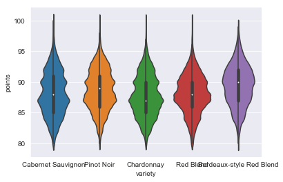


# Faceting with seaborn

* 将数据分解成为多个子图

## load data

* FIFA 足球数据


```python
pd.set_option('max_columns', None)
df = pd.read_csv(
    "fifa-18-demo-player-dataset/CompleteDataset.csv", index_col=0)
import re
import numpy as np

footballers = df.copy()
footballers['Unit'] = df['Value'].str[-1]
footballers['Value (M)'] = np.where(
    footballers['Unit'] == '0', 0, footballers['Value'].str[1:-1].replace(
        r'[a-zA-Z]', ''))
footballers['Value (M)'] = footballers['Value (M)'].astype(float)
footballers['Value (M)'] = np.where(footballers['Unit'] == 'M',
                                    footballers['Value (M)'],
                                    footballers['Value (M)'] / 1000)
footballers = footballers.assign(
    Value=footballers['Value (M)'],
    Position=footballers['Preferred Positions'].str.split().str[0])
footballers.head()
```

    /Users/liuchuang/anaconda3/envs/tensorflow/lib/python3.6/site-packages/IPython/core/interactiveshell.py:2785: DtypeWarning: Columns (23,35) have mixed types. Specify dtype option on import or set low_memory=False.
      interactivity=interactivity, compiler=compiler, result=result)


<div>
<style scoped>
    .dataframe tbody tr th:only-of-type {
        vertical-align: middle;
    }

    .dataframe tbody tr th {
        vertical-align: top;
    }

    .dataframe thead th {
        text-align: right;
    }
</style>
<table border="1" class="dataframe">
  <thead>
    <tr style="text-align: right;">
      <th></th>
      <th>Name</th>
      <th>Age</th>
      <th>Photo</th>
      <th>Nationality</th>
      <th>Flag</th>
      <th>Overall</th>
      <th>Potential</th>
      <th>Club</th>
      <th>Club Logo</th>
      <th>Value</th>
      <th>Wage</th>
      <th>Special</th>
      <th>Acceleration</th>
      <th>Aggression</th>
      <th>Agility</th>
      <th>Balance</th>
      <th>Ball control</th>
      <th>Composure</th>
      <th>Crossing</th>
      <th>Curve</th>
      <th>Dribbling</th>
      <th>Finishing</th>
      <th>Free kick accuracy</th>
      <th>GK diving</th>
      <th>GK handling</th>
      <th>GK kicking</th>
      <th>GK positioning</th>
      <th>GK reflexes</th>
      <th>Heading accuracy</th>
      <th>Interceptions</th>
      <th>Jumping</th>
      <th>Long passing</th>
      <th>Long shots</th>
      <th>Marking</th>
      <th>Penalties</th>
      <th>Positioning</th>
      <th>Reactions</th>
      <th>Short passing</th>
      <th>Shot power</th>
      <th>Sliding tackle</th>
      <th>Sprint speed</th>
      <th>Stamina</th>
      <th>Standing tackle</th>
      <th>Strength</th>
      <th>Vision</th>
      <th>Volleys</th>
      <th>CAM</th>
      <th>CB</th>
      <th>CDM</th>
      <th>CF</th>
      <th>CM</th>
      <th>ID</th>
      <th>LAM</th>
      <th>LB</th>
      <th>LCB</th>
      <th>LCM</th>
      <th>LDM</th>
      <th>LF</th>
      <th>LM</th>
      <th>LS</th>
      <th>LW</th>
      <th>LWB</th>
      <th>Preferred Positions</th>
      <th>RAM</th>
      <th>RB</th>
      <th>RCB</th>
      <th>RCM</th>
      <th>RDM</th>
      <th>RF</th>
      <th>RM</th>
      <th>RS</th>
      <th>RW</th>
      <th>RWB</th>
      <th>ST</th>
      <th>Unit</th>
      <th>Value (M)</th>
      <th>Position</th>
    </tr>
  </thead>
  <tbody>
    <tr>
      <th>0</th>
      <td>Cristiano Ronaldo</td>
      <td>32</td>
      <td>https://cdn.sofifa.org/48/18/players/20801.png</td>
      <td>Portugal</td>
      <td>https://cdn.sofifa.org/flags/38.png</td>
      <td>94</td>
      <td>94</td>
      <td>Real Madrid CF</td>
      <td>https://cdn.sofifa.org/24/18/teams/243.png</td>
      <td>95.5</td>
      <td>€565K</td>
      <td>2228</td>
      <td>89</td>
      <td>63</td>
      <td>89</td>
      <td>63</td>
      <td>93</td>
      <td>95</td>
      <td>85</td>
      <td>81</td>
      <td>91</td>
      <td>94</td>
      <td>76</td>
      <td>7</td>
      <td>11</td>
      <td>15</td>
      <td>14</td>
      <td>11</td>
      <td>88</td>
      <td>29</td>
      <td>95</td>
      <td>77</td>
      <td>92</td>
      <td>22</td>
      <td>85</td>
      <td>95</td>
      <td>96</td>
      <td>83</td>
      <td>94</td>
      <td>23</td>
      <td>91</td>
      <td>92</td>
      <td>31</td>
      <td>80</td>
      <td>85</td>
      <td>88</td>
      <td>89.0</td>
      <td>53.0</td>
      <td>62.0</td>
      <td>91.0</td>
      <td>82.0</td>
      <td>20801</td>
      <td>89.0</td>
      <td>61.0</td>
      <td>53.0</td>
      <td>82.0</td>
      <td>62.0</td>
      <td>91.0</td>
      <td>89.0</td>
      <td>92.0</td>
      <td>91.0</td>
      <td>66.0</td>
      <td>ST LW</td>
      <td>89.0</td>
      <td>61.0</td>
      <td>53.0</td>
      <td>82.0</td>
      <td>62.0</td>
      <td>91.0</td>
      <td>89.0</td>
      <td>92.0</td>
      <td>91.0</td>
      <td>66.0</td>
      <td>92.0</td>
      <td>M</td>
      <td>95.5</td>
      <td>ST</td>
    </tr>
    <tr>
      <th>1</th>
      <td>L. Messi</td>
      <td>30</td>
      <td>https://cdn.sofifa.org/48/18/players/158023.png</td>
      <td>Argentina</td>
      <td>https://cdn.sofifa.org/flags/52.png</td>
      <td>93</td>
      <td>93</td>
      <td>FC Barcelona</td>
      <td>https://cdn.sofifa.org/24/18/teams/241.png</td>
      <td>105.0</td>
      <td>€565K</td>
      <td>2154</td>
      <td>92</td>
      <td>48</td>
      <td>90</td>
      <td>95</td>
      <td>95</td>
      <td>96</td>
      <td>77</td>
      <td>89</td>
      <td>97</td>
      <td>95</td>
      <td>90</td>
      <td>6</td>
      <td>11</td>
      <td>15</td>
      <td>14</td>
      <td>8</td>
      <td>71</td>
      <td>22</td>
      <td>68</td>
      <td>87</td>
      <td>88</td>
      <td>13</td>
      <td>74</td>
      <td>93</td>
      <td>95</td>
      <td>88</td>
      <td>85</td>
      <td>26</td>
      <td>87</td>
      <td>73</td>
      <td>28</td>
      <td>59</td>
      <td>90</td>
      <td>85</td>
      <td>92.0</td>
      <td>45.0</td>
      <td>59.0</td>
      <td>92.0</td>
      <td>84.0</td>
      <td>158023</td>
      <td>92.0</td>
      <td>57.0</td>
      <td>45.0</td>
      <td>84.0</td>
      <td>59.0</td>
      <td>92.0</td>
      <td>90.0</td>
      <td>88.0</td>
      <td>91.0</td>
      <td>62.0</td>
      <td>RW</td>
      <td>92.0</td>
      <td>57.0</td>
      <td>45.0</td>
      <td>84.0</td>
      <td>59.0</td>
      <td>92.0</td>
      <td>90.0</td>
      <td>88.0</td>
      <td>91.0</td>
      <td>62.0</td>
      <td>88.0</td>
      <td>M</td>
      <td>105.0</td>
      <td>RW</td>
    </tr>
    <tr>
      <th>2</th>
      <td>Neymar</td>
      <td>25</td>
      <td>https://cdn.sofifa.org/48/18/players/190871.png</td>
      <td>Brazil</td>
      <td>https://cdn.sofifa.org/flags/54.png</td>
      <td>92</td>
      <td>94</td>
      <td>Paris Saint-Germain</td>
      <td>https://cdn.sofifa.org/24/18/teams/73.png</td>
      <td>123.0</td>
      <td>€280K</td>
      <td>2100</td>
      <td>94</td>
      <td>56</td>
      <td>96</td>
      <td>82</td>
      <td>95</td>
      <td>92</td>
      <td>75</td>
      <td>81</td>
      <td>96</td>
      <td>89</td>
      <td>84</td>
      <td>9</td>
      <td>9</td>
      <td>15</td>
      <td>15</td>
      <td>11</td>
      <td>62</td>
      <td>36</td>
      <td>61</td>
      <td>75</td>
      <td>77</td>
      <td>21</td>
      <td>81</td>
      <td>90</td>
      <td>88</td>
      <td>81</td>
      <td>80</td>
      <td>33</td>
      <td>90</td>
      <td>78</td>
      <td>24</td>
      <td>53</td>
      <td>80</td>
      <td>83</td>
      <td>88.0</td>
      <td>46.0</td>
      <td>59.0</td>
      <td>88.0</td>
      <td>79.0</td>
      <td>190871</td>
      <td>88.0</td>
      <td>59.0</td>
      <td>46.0</td>
      <td>79.0</td>
      <td>59.0</td>
      <td>88.0</td>
      <td>87.0</td>
      <td>84.0</td>
      <td>89.0</td>
      <td>64.0</td>
      <td>LW</td>
      <td>88.0</td>
      <td>59.0</td>
      <td>46.0</td>
      <td>79.0</td>
      <td>59.0</td>
      <td>88.0</td>
      <td>87.0</td>
      <td>84.0</td>
      <td>89.0</td>
      <td>64.0</td>
      <td>84.0</td>
      <td>M</td>
      <td>123.0</td>
      <td>LW</td>
    </tr>
    <tr>
      <th>3</th>
      <td>L. Suárez</td>
      <td>30</td>
      <td>https://cdn.sofifa.org/48/18/players/176580.png</td>
      <td>Uruguay</td>
      <td>https://cdn.sofifa.org/flags/60.png</td>
      <td>92</td>
      <td>92</td>
      <td>FC Barcelona</td>
      <td>https://cdn.sofifa.org/24/18/teams/241.png</td>
      <td>97.0</td>
      <td>€510K</td>
      <td>2291</td>
      <td>88</td>
      <td>78</td>
      <td>86</td>
      <td>60</td>
      <td>91</td>
      <td>83</td>
      <td>77</td>
      <td>86</td>
      <td>86</td>
      <td>94</td>
      <td>84</td>
      <td>27</td>
      <td>25</td>
      <td>31</td>
      <td>33</td>
      <td>37</td>
      <td>77</td>
      <td>41</td>
      <td>69</td>
      <td>64</td>
      <td>86</td>
      <td>30</td>
      <td>85</td>
      <td>92</td>
      <td>93</td>
      <td>83</td>
      <td>87</td>
      <td>38</td>
      <td>77</td>
      <td>89</td>
      <td>45</td>
      <td>80</td>
      <td>84</td>
      <td>88</td>
      <td>87.0</td>
      <td>58.0</td>
      <td>65.0</td>
      <td>88.0</td>
      <td>80.0</td>
      <td>176580</td>
      <td>87.0</td>
      <td>64.0</td>
      <td>58.0</td>
      <td>80.0</td>
      <td>65.0</td>
      <td>88.0</td>
      <td>85.0</td>
      <td>88.0</td>
      <td>87.0</td>
      <td>68.0</td>
      <td>ST</td>
      <td>87.0</td>
      <td>64.0</td>
      <td>58.0</td>
      <td>80.0</td>
      <td>65.0</td>
      <td>88.0</td>
      <td>85.0</td>
      <td>88.0</td>
      <td>87.0</td>
      <td>68.0</td>
      <td>88.0</td>
      <td>M</td>
      <td>97.0</td>
      <td>ST</td>
    </tr>
    <tr>
      <th>4</th>
      <td>M. Neuer</td>
      <td>31</td>
      <td>https://cdn.sofifa.org/48/18/players/167495.png</td>
      <td>Germany</td>
      <td>https://cdn.sofifa.org/flags/21.png</td>
      <td>92</td>
      <td>92</td>
      <td>FC Bayern Munich</td>
      <td>https://cdn.sofifa.org/24/18/teams/21.png</td>
      <td>61.0</td>
      <td>€230K</td>
      <td>1493</td>
      <td>58</td>
      <td>29</td>
      <td>52</td>
      <td>35</td>
      <td>48</td>
      <td>70</td>
      <td>15</td>
      <td>14</td>
      <td>30</td>
      <td>13</td>
      <td>11</td>
      <td>91</td>
      <td>90</td>
      <td>95</td>
      <td>91</td>
      <td>89</td>
      <td>25</td>
      <td>30</td>
      <td>78</td>
      <td>59</td>
      <td>16</td>
      <td>10</td>
      <td>47</td>
      <td>12</td>
      <td>85</td>
      <td>55</td>
      <td>25</td>
      <td>11</td>
      <td>61</td>
      <td>44</td>
      <td>10</td>
      <td>83</td>
      <td>70</td>
      <td>11</td>
      <td>NaN</td>
      <td>NaN</td>
      <td>NaN</td>
      <td>NaN</td>
      <td>NaN</td>
      <td>167495</td>
      <td>NaN</td>
      <td>NaN</td>
      <td>NaN</td>
      <td>NaN</td>
      <td>NaN</td>
      <td>NaN</td>
      <td>NaN</td>
      <td>NaN</td>
      <td>NaN</td>
      <td>NaN</td>
      <td>GK</td>
      <td>NaN</td>
      <td>NaN</td>
      <td>NaN</td>
      <td>NaN</td>
      <td>NaN</td>
      <td>NaN</td>
      <td>NaN</td>
      <td>NaN</td>
      <td>NaN</td>
      <td>NaN</td>
      <td>NaN</td>
      <td>M</td>
      <td>61.0</td>
      <td>GK</td>
    </tr>
  </tbody>
</table>
</div>


* 怀念高中时代的 MSN ，真的是 又强势又有爱，后来马儿走了，苏牙有点跑不动，冲击力弱了些，好在梅老五依然强无敌，强行给球迷续青春

## Plot

* 比较 前锋 和 门将


```python
df = footballers[footballers['Position'].isin(['ST', 'GK'])]
g = sns.FacetGrid(df, col="Position") # col 分割变量
g.map(sns.kdeplot, "Overall")  # 将数据放入 图

```


    <seaborn.axisgrid.FacetGrid at 0x1a2b39a390>


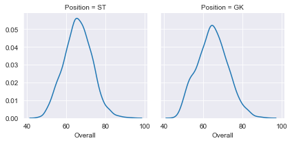


* 所有位置 球员


```python
df = footballers

g = sns.FacetGrid(df, col="Position", col_wrap=6)  # 每行最多放置 6个子图
g.map(sns.kdeplot, "Overall")
```


    <seaborn.axisgrid.FacetGrid at 0x1a2c784ef0>


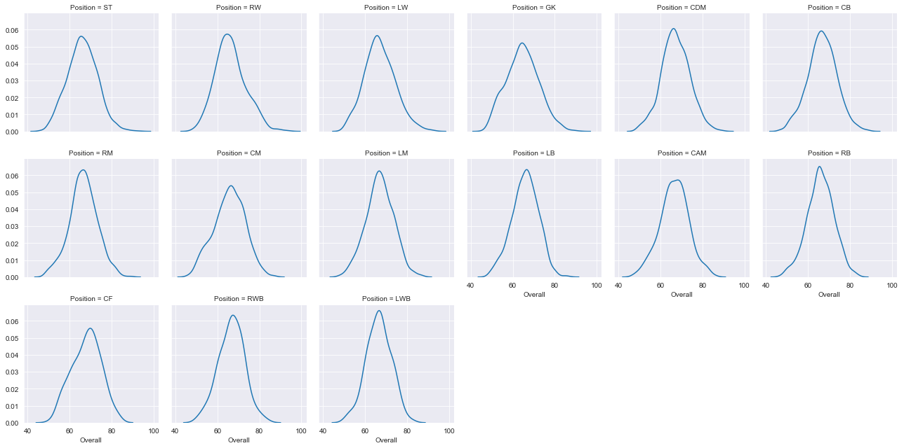


```python
df = footballers

g = sns.FacetGrid(df, col="Position")
g.map(sns.kdeplot, "Overall")

```


    <seaborn.axisgrid.FacetGrid at 0x11a03cf98>


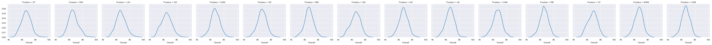


* 分析 西甲三巨头中 前锋 门将的数据
* 按照 俱乐部 和位置 绘图


```python
df = footballers[footballers['Position'].isin(['ST', 'GK'])]
df = df[df['Club'].isin(['Real Madrid CF', 'FC Barcelona', 'Atlético Madrid'])]

g = sns.FacetGrid(df, row="Position", col="Club")
g.map(sns.violinplot, "Overall")
```

    /Users/liuchuang/anaconda3/envs/tensorflow/lib/python3.6/site-packages/seaborn/axisgrid.py:715: UserWarning: Using the violinplot function without specifying `order` is likely to produce an incorrect plot.
      warnings.warn(warning)
    /Users/liuchuang/anaconda3/envs/tensorflow/lib/python3.6/site-packages/scipy/stats/stats.py:1713: FutureWarning: Using a non-tuple sequence for multidimensional indexing is deprecated; use `arr[tuple(seq)]` instead of `arr[seq]`. In the future this will be interpreted as an array index, `arr[np.array(seq)]`, which will result either in an error or a different result.
      return np.add.reduce(sorted[indexer] * weights, axis=axis) / sumval


    <seaborn.axisgrid.FacetGrid at 0x1a29a3fcf8>


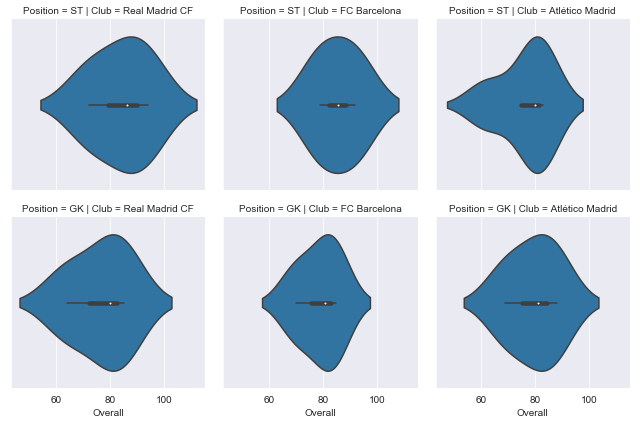


* 可以自定义绘图的顺序


```python
df = footballers[footballers['Position'].isin(['ST', 'GK'])]
df = df[df['Club'].isin(['Real Madrid CF', 'FC Barcelona', 'Atlético Madrid'])]

g = sns.FacetGrid(df, row="Position", col="Club", 
                  row_order=['GK', 'ST'],
                  col_order=['Atlético Madrid', 'FC Barcelona', 'Real Madrid CF'])
g.map(sns.violinplot, "Overall")
```

    /Users/liuchuang/anaconda3/envs/tensorflow/lib/python3.6/site-packages/seaborn/axisgrid.py:715: UserWarning: Using the violinplot function without specifying `order` is likely to produce an incorrect plot.
      warnings.warn(warning)
    /Users/liuchuang/anaconda3/envs/tensorflow/lib/python3.6/site-packages/scipy/stats/stats.py:1713: FutureWarning: Using a non-tuple sequence for multidimensional indexing is deprecated; use `arr[tuple(seq)]` instead of `arr[seq]`. In the future this will be interpreted as an array index, `arr[np.array(seq)]`, which will result either in an error or a different result.
      return np.add.reduce(sorted[indexer] * weights, axis=axis) / sumval


    <seaborn.axisgrid.FacetGrid at 0x1a2fdf8128>


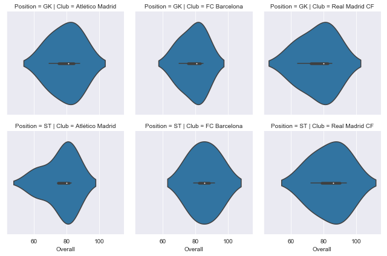


# pairplot

* 类似于 gridsearch  所有的变量生成一个棋盘网格，俩俩排列组合


```python
sns.pairplot(footballers[['Overall', 'Potential', 'Value']])
```


    <seaborn.axisgrid.PairGrid at 0x119a1d438>


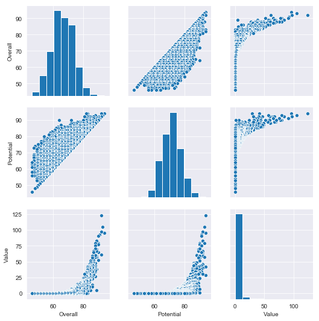


* 默认绘制 散点图 
* 对角线默认 histogram

> Signature: sns.pairplot(data, hue=None, hue_order=None, palette=None, vars=None, x_vars=None, y_vars=None, kind='scatter', diag_kind='auto', markers=None, height=2.5, aspect=1, dropna=True, plot_kws=None, diag_kws=None, grid_kws=None, size=None)


```python
sns.pairplot(footballers[['Overall', 'Potential', 'Value']],
             kind='reg')
```

    /Users/liuchuang/anaconda3/envs/tensorflow/lib/python3.6/site-packages/scipy/stats/stats.py:1713: FutureWarning: Using a non-tuple sequence for multidimensional indexing is deprecated; use `arr[tuple(seq)]` instead of `arr[seq]`. In the future this will be interpreted as an array index, `arr[np.array(seq)]`, which will result either in an error or a different result.
      return np.add.reduce(sorted[indexer] * weights, axis=axis) / sumval


    <seaborn.axisgrid.PairGrid at 0x1a34382e48>


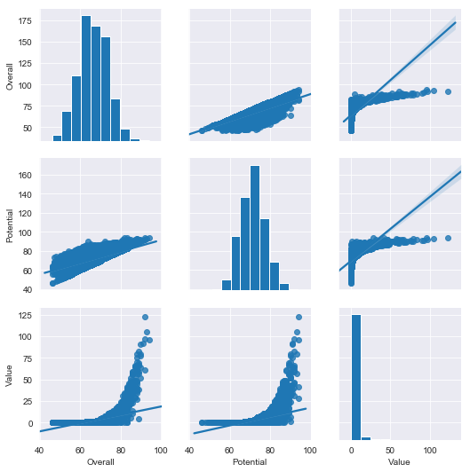


* 看出潜力和 综合评分正相关


```python
sns.pairplot(footballers[['Overall', 'Potential', 'Value']].sample(100),
             kind='reg')
```

    /Users/liuchuang/anaconda3/envs/tensorflow/lib/python3.6/site-packages/scipy/stats/stats.py:1713: FutureWarning: Using a non-tuple sequence for multidimensional indexing is deprecated; use `arr[tuple(seq)]` instead of `arr[seq]`. In the future this will be interpreted as an array index, `arr[np.array(seq)]`, which will result either in an error or a different result.
      return np.add.reduce(sorted[indexer] * weights, axis=axis) / sumval


    <seaborn.axisgrid.PairGrid at 0x1a34c605f8>


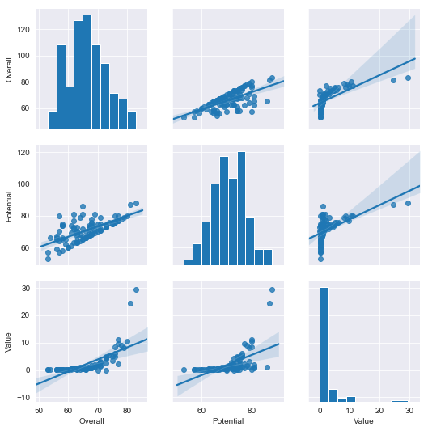

