<h1>Table of Contents<span class="tocSkip"></span></h1>
<div class="toc"><ul class="toc-item"><li><span><a href="#Data-Visualization" data-toc-modified-id="Data-Visualization-1"><span class="toc-item-num">1&nbsp;&nbsp;</span>Data Visualization</a></span></li><li><span><a href="#使用-Pandas-单变量绘制" data-toc-modified-id="使用-Pandas-单变量绘制-2"><span class="toc-item-num">2&nbsp;&nbsp;</span>使用 Pandas 单变量绘制</a></span><ul class="toc-item"><li><span><a href="#Load-data" data-toc-modified-id="Load-data-2.1"><span class="toc-item-num">2.1&nbsp;&nbsp;</span>Load data</a></span></li><li><span><a href="#Plot-Data" data-toc-modified-id="Plot-Data-2.2"><span class="toc-item-num">2.2&nbsp;&nbsp;</span>Plot Data</a></span><ul class="toc-item"><li><span><a href="#Bar-Charts" data-toc-modified-id="Bar-Charts-2.2.1"><span class="toc-item-num">2.2.1&nbsp;&nbsp;</span>Bar Charts</a></span></li><li><span><a href="#Line-charts" data-toc-modified-id="Line-charts-2.2.2"><span class="toc-item-num">2.2.2&nbsp;&nbsp;</span>Line charts</a></span></li><li><span><a href="#Area-chart" data-toc-modified-id="Area-chart-2.2.3"><span class="toc-item-num">2.2.3&nbsp;&nbsp;</span>Area chart</a></span></li><li><span><a href="#Histograms" data-toc-modified-id="Histograms-2.2.4"><span class="toc-item-num">2.2.4&nbsp;&nbsp;</span>Histograms</a></span></li><li><span><a href="#Pie-Charts" data-toc-modified-id="Pie-Charts-2.2.5"><span class="toc-item-num">2.2.5&nbsp;&nbsp;</span>Pie Charts</a></span></li></ul></li></ul></li><li><span><a href="#使用-pandas-进行-2个-变量绘制" data-toc-modified-id="使用-pandas-进行-2个-变量绘制-3"><span class="toc-item-num">3&nbsp;&nbsp;</span>使用 pandas 进行 2个 变量绘制</a></span><ul class="toc-item"><li><span><a href="#Scatter-plot" data-toc-modified-id="Scatter-plot-3.1"><span class="toc-item-num">3.1&nbsp;&nbsp;</span>Scatter plot</a></span></li><li><span><a href="#Stacked-Plots" data-toc-modified-id="Stacked-Plots-3.2"><span class="toc-item-num">3.2&nbsp;&nbsp;</span>Stacked Plots</a></span></li><li><span><a href="#Line-chart" data-toc-modified-id="Line-chart-3.3"><span class="toc-item-num">3.3&nbsp;&nbsp;</span>Line chart</a></span></li></ul></li><li><span><a href="#Styling-your-plot" data-toc-modified-id="Styling-your-plot-4"><span class="toc-item-num">4&nbsp;&nbsp;</span>Styling your plot</a></span><ul class="toc-item"><li><span><a href="#Data" data-toc-modified-id="Data-4.1"><span class="toc-item-num">4.1&nbsp;&nbsp;</span>Data</a></span></li><li><span><a href="#Figure-size" data-toc-modified-id="Figure-size-4.2"><span class="toc-item-num">4.2&nbsp;&nbsp;</span>Figure size</a></span></li><li><span><a href="#Color-----bar" data-toc-modified-id="Color-----bar-4.3"><span class="toc-item-num">4.3&nbsp;&nbsp;</span>Color --  bar</a></span></li><li><span><a href="#Fontsize" data-toc-modified-id="Fontsize-4.4"><span class="toc-item-num">4.4&nbsp;&nbsp;</span>Fontsize</a></span></li><li><span><a href="#Title" data-toc-modified-id="Title-4.5"><span class="toc-item-num">4.5&nbsp;&nbsp;</span>Title</a></span></li></ul></li><li><span><a href="#Subplots" data-toc-modified-id="Subplots-5"><span class="toc-item-num">5&nbsp;&nbsp;</span>Subplots</a></span><ul class="toc-item"><li><span><a href="#Data" data-toc-modified-id="Data-5.1"><span class="toc-item-num">5.1&nbsp;&nbsp;</span>Data</a></span></li></ul></li></ul></div>

# Data Visualization
* 原文 link ---- https://www.kaggle.com/learn/data-visualization

* pandas 
* seaborn 
* matplotlib 

# 使用 Pandas 单变量绘制

* pandas 不仅仅可以 transform data
也可以 plot data

**pandas 可视化工具是建立在其他的上面的，matplotlib 是 lower-level ,所以pandas 中的图都可以使用 matplotlib**


```python
import pandas as pd 
import matplotlib.pyplot as plt  
%matplotlib inline  # 原文没有，如果缺失，图形不会显示
```

## Load data

* 红酒的评价数据


```python
reviews = pd.read_csv("wine-reviews/winemag-data_first150k.csv", index_col=0)
#  第 0 列 作为行索引
reviews.head()
```


<div>
<style scoped>
    .dataframe tbody tr th:only-of-type {
        vertical-align: middle;
    }

    .dataframe tbody tr th {
        vertical-align: top;
    }

    .dataframe thead th {
        text-align: right;
    }
</style>
<table border="1" class="dataframe">
  <thead>
    <tr style="text-align: right;">
      <th></th>
      <th>country</th>
      <th>description</th>
      <th>designation</th>
      <th>points</th>
      <th>price</th>
      <th>province</th>
      <th>region_1</th>
      <th>region_2</th>
      <th>variety</th>
      <th>winery</th>
    </tr>
  </thead>
  <tbody>
    <tr>
      <th>0</th>
      <td>US</td>
      <td>This tremendous 100% varietal wine hails from ...</td>
      <td>Martha's Vineyard</td>
      <td>96</td>
      <td>235.0</td>
      <td>California</td>
      <td>Napa Valley</td>
      <td>Napa</td>
      <td>Cabernet Sauvignon</td>
      <td>Heitz</td>
    </tr>
    <tr>
      <th>1</th>
      <td>Spain</td>
      <td>Ripe aromas of fig, blackberry and cassis are ...</td>
      <td>Carodorum Selección Especial Reserva</td>
      <td>96</td>
      <td>110.0</td>
      <td>Northern Spain</td>
      <td>Toro</td>
      <td>NaN</td>
      <td>Tinta de Toro</td>
      <td>Bodega Carmen Rodríguez</td>
    </tr>
    <tr>
      <th>2</th>
      <td>US</td>
      <td>Mac Watson honors the memory of a wine once ma...</td>
      <td>Special Selected Late Harvest</td>
      <td>96</td>
      <td>90.0</td>
      <td>California</td>
      <td>Knights Valley</td>
      <td>Sonoma</td>
      <td>Sauvignon Blanc</td>
      <td>Macauley</td>
    </tr>
    <tr>
      <th>3</th>
      <td>US</td>
      <td>This spent 20 months in 30% new French oak, an...</td>
      <td>Reserve</td>
      <td>96</td>
      <td>65.0</td>
      <td>Oregon</td>
      <td>Willamette Valley</td>
      <td>Willamette Valley</td>
      <td>Pinot Noir</td>
      <td>Ponzi</td>
    </tr>
    <tr>
      <th>4</th>
      <td>France</td>
      <td>This is the top wine from La Bégude, named aft...</td>
      <td>La Brûlade</td>
      <td>95</td>
      <td>66.0</td>
      <td>Provence</td>
      <td>Bandol</td>
      <td>NaN</td>
      <td>Provence red blend</td>
      <td>Domaine de la Bégude</td>
    </tr>
  </tbody>
</table>
</div>


## Plot Data

###  Bar Charts

* 可视化红酒 不同产地的数目
* 调用 province 列的数据
* 展示 产出数目前十名


```python
reviews['province'].value_counts()  # 对值进行计数并且排序（默认降序排列）
# reviews['province'].value_counts(normalize=True) # 显示百分比
# 返回值是 series 类型
```


    California                                44508
    Washington                                 9750
    Tuscany                                    7281
    Bordeaux                                   6111
    Northern Spain                             4892
    Mendoza Province                           4742
    Oregon                                     4589
    Burgundy                                   4308
    Piedmont                                   4093
    Veneto                                     3962
    South Australia                            3004
    Sicily & Sardinia                          2545
    New York                                   2428
    Northeastern Italy                         1982
    Loire Valley                               1786
    Alsace                                     1680
    Marlborough                                1655
    Southwest France                           1601
    Central Italy                              1530
    Southern Italy                             1439
    Champagne                                  1370
    Catalonia                                  1352
    Rhône Valley                               1318
    Colchagua Valley                           1201
    Languedoc-Roussillon                       1082
    Douro                                      1075
    Provence                                   1021
    Port                                        903
    Maipo Valley                                895
    Other                                       889
                                              ...  
    Cape South Coast                              1
    San Clemente                                  1
    Viile Carasului                               1
    Terasele Dunarii                              1
    Vino da Tavola della Svizzera Italiana        1
    Dolenjska                                     1
    Pafos                                         1
    Maipo Valley-Colchagua Valley                 1
    Slovenska Istra                               1
    Sterea Ellada                                 1
    Pannon                                        1
    Rose Valley                                   1
    Pocerina                                      1
    Valais                                        1
    Morocco                                       1
    Malgas                                        1
    Casablanca-Curicó Valley                      1
    Ioannina                                      1
    Douro Superior                                1
    Vale Trentino                                 1
    Serra do Sudeste                              1
    Elim                                          1
    Central Otago-Marlborough                     1
    Dalmatian Coast                               1
    Santa Barbara County-Condrieu                 1
    Central Greece                                1
    Ilia                                          1
    Nevada                                        1
    Zitsa                                         1
    Colchagua Costa                               1
    Name: province, Length: 455, dtype: int64


```python
reviews['province'].value_counts().head(10).plot.bar()
```


    <matplotlib.axes._subplots.AxesSubplot at 0x1140b0eb8>


* 可以看出 加利福尼亚产出最大 ，
* 但是我们想看一下占比


```python
reviews['province'].value_counts(normalize=True).head(10).plot.bar()

# 等价于原文的 (reviews['province'].value_counts().head(10) / len(reviews)).plot.bar()

```


    <matplotlib.axes._subplots.AxesSubplot at 0x114146dd8>


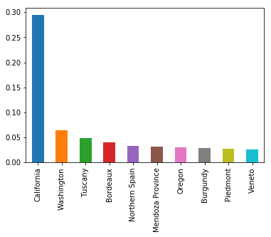


* 这样可以看出 加利福尼亚占比 近 1/3

--------

* 上面的 类别之间是没有 order  的
* 但是像评分分数这样的 类别之间是存在 order 的


```python
reviews['points'].value_counts().sort_index().plot.bar()
```


    <matplotlib.axes._subplots.AxesSubplot at 0x10f942a20>


* 其中 sort_index 就是评分按照从高到低排序

### Line charts

* 如果类别 过多，上面的bar 值就会特别的密集

* line 图就不会存在这样的问题
* 但是 line 只能表示那些 有order 的


```python
reviews['points'].value_counts().sort_index().plot.line()
```


    <matplotlib.axes._subplots.AxesSubplot at 0x10fb7eb70>


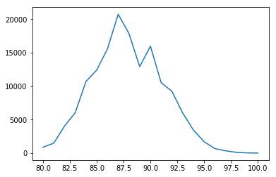


* 将上面的 bar 图 转化成为 line

### Area chart

* 就是 将line 下面进行填充


```python
reviews['points'].value_counts().sort_index().plot.area()
```


    <matplotlib.axes._subplots.AxesSubplot at 0x10fcc3198>


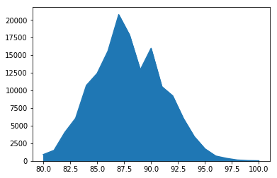


### Histograms

* 绘制  interval variable

* 就是存在 区间的数据，例如价格落在 50-100之间的商品有多少


```python
reviews[reviews['price'] < 200]['price'].plot.hist()
# reviews['price'] < 200 数据筛选
```


    <matplotlib.axes._subplots.AxesSubplot at 0x11464f6d8>


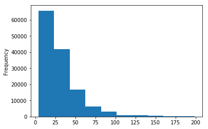


* 但是 hist 对于存在偏斜的数据（分布很不均匀）表现不abs很好
* 上面我们只是截取到 200， 展示全部就可以看出


```python
reviews['price'].plot.hist()
```


    <matplotlib.axes._subplots.AxesSubplot at 0x10f4881d0>


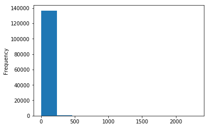


```python
reviews['points'].plot.hist()
```


    <matplotlib.axes._subplots.AxesSubplot at 0x11483f7f0>


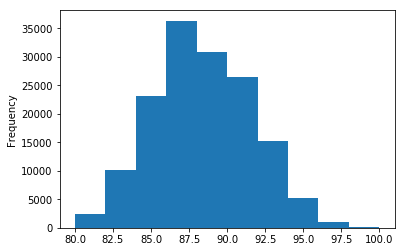


* 对于评分这种分布较为均衡的数据，表现较好

###  Pie Charts

* 缺点是 无法比较某些类别的大小


```python
reviews['province'].value_counts().head(10).plot.pie()
plt.gca().set_aspect('equal') # 调整图形比例‘
```


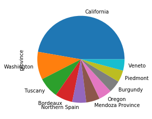


# 使用 pandas 进行 2个 变量绘制

## Scatter plot

* 价格和评分的散点图


```python
reviews[reviews['price'] < 100].sample(
    100, random_state=6137).plot.scatter(
        x='price', y='points')
# sample 从一列/行数据里返回指定数量的随机样本。
# random state 确定每次选择的相同
```


    <matplotlib.axes._subplots.AxesSubplot at 0x114834278>


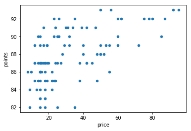


## Stacked Plots

* 每种酒 收到不同评分的次数


```python
wine_counts = pd.read_csv(
    "most-common-wine-scores/top-five-wine-score-counts.csv", index_col=0)
wine_counts.head()
```


<div>
<style scoped>
    .dataframe tbody tr th:only-of-type {
        vertical-align: middle;
    }

    .dataframe tbody tr th {
        vertical-align: top;
    }

    .dataframe thead th {
        text-align: right;
    }
</style>
<table border="1" class="dataframe">
  <thead>
    <tr style="text-align: right;">
      <th></th>
      <th>Bordeaux-style Red Blend</th>
      <th>Cabernet Sauvignon</th>
      <th>Chardonnay</th>
      <th>Pinot Noir</th>
      <th>Red Blend</th>
    </tr>
    <tr>
      <th>points</th>
      <th></th>
      <th></th>
      <th></th>
      <th></th>
      <th></th>
    </tr>
  </thead>
  <tbody>
    <tr>
      <th>80</th>
      <td>5.0</td>
      <td>87.0</td>
      <td>68.0</td>
      <td>36.0</td>
      <td>72.0</td>
    </tr>
    <tr>
      <th>81</th>
      <td>18.0</td>
      <td>159.0</td>
      <td>150.0</td>
      <td>83.0</td>
      <td>107.0</td>
    </tr>
    <tr>
      <th>82</th>
      <td>72.0</td>
      <td>435.0</td>
      <td>517.0</td>
      <td>295.0</td>
      <td>223.0</td>
    </tr>
    <tr>
      <th>83</th>
      <td>95.0</td>
      <td>570.0</td>
      <td>669.0</td>
      <td>346.0</td>
      <td>364.0</td>
    </tr>
    <tr>
      <th>84</th>
      <td>268.0</td>
      <td>923.0</td>
      <td>1146.0</td>
      <td>733.0</td>
      <td>602.0</td>
    </tr>
  </tbody>
</table>
</div>


```python
wine_counts.plot.bar(stacked=True)
```


    <matplotlib.axes._subplots.AxesSubplot at 0x1153f5f60>


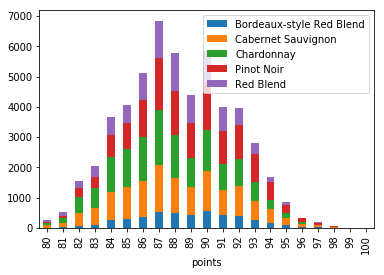


```python
wine_counts.plot.area()
```


    <matplotlib.axes._subplots.AxesSubplot at 0x115a289b0>


* 类似于单变量 area 就是 bar 的线性的填充

## Line chart

* 具体比较不同类别中的数值： 85分 中 哪种酒最多


```python
wine_counts.plot.line()
```


    <matplotlib.axes._subplots.AxesSubplot at 0x11646d780>


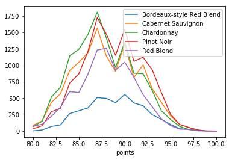


# Styling your plot

* change figure size
* change colors
* fontsize 
* removing axis boreders


##  Data


```python
reviews.head(2)
```


<div>
<style scoped>
    .dataframe tbody tr th:only-of-type {
        vertical-align: middle;
    }

    .dataframe tbody tr th {
        vertical-align: top;
    }

    .dataframe thead th {
        text-align: right;
    }
</style>
<table border="1" class="dataframe">
  <thead>
    <tr style="text-align: right;">
      <th></th>
      <th>country</th>
      <th>description</th>
      <th>designation</th>
      <th>points</th>
      <th>price</th>
      <th>province</th>
      <th>region_1</th>
      <th>region_2</th>
      <th>variety</th>
      <th>winery</th>
    </tr>
  </thead>
  <tbody>
    <tr>
      <th>0</th>
      <td>US</td>
      <td>This tremendous 100% varietal wine hails from ...</td>
      <td>Martha's Vineyard</td>
      <td>96</td>
      <td>235.0</td>
      <td>California</td>
      <td>Napa Valley</td>
      <td>Napa</td>
      <td>Cabernet Sauvignon</td>
      <td>Heitz</td>
    </tr>
    <tr>
      <th>1</th>
      <td>Spain</td>
      <td>Ripe aromas of fig, blackberry and cassis are ...</td>
      <td>Carodorum Selección Especial Reserva</td>
      <td>96</td>
      <td>110.0</td>
      <td>Northern Spain</td>
      <td>Toro</td>
      <td>NaN</td>
      <td>Tinta de Toro</td>
      <td>Bodega Carmen Rodríguez</td>
    </tr>
  </tbody>
</table>
</div>


```python
reviews['points'].value_counts().sort_index().plot.bar()
```


    <matplotlib.axes._subplots.AxesSubplot at 0x1164ce7b8>


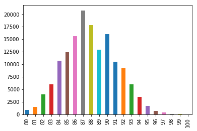


* 之前我们画的 不同分数统计 bar 图

## Figure size


```python
reviews['points'].value_counts().sort_index().plot.bar(figsize=(40, 20))
# * size ： inchs
```


    <matplotlib.axes._subplots.AxesSubplot at 0x11711a9e8>


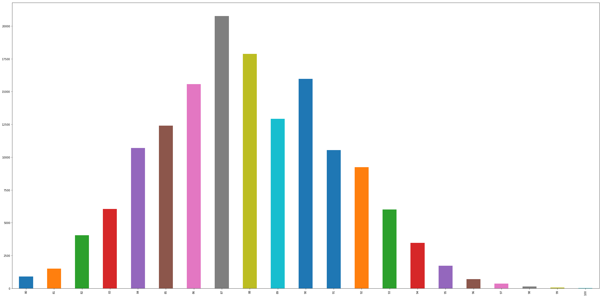


## Color --  bar


```python
reviews['points'].value_counts().sort_index().plot.bar(
    figsize=(40, 20), color='blue')
```


    <matplotlib.axes._subplots.AxesSubplot at 0x117892e48>


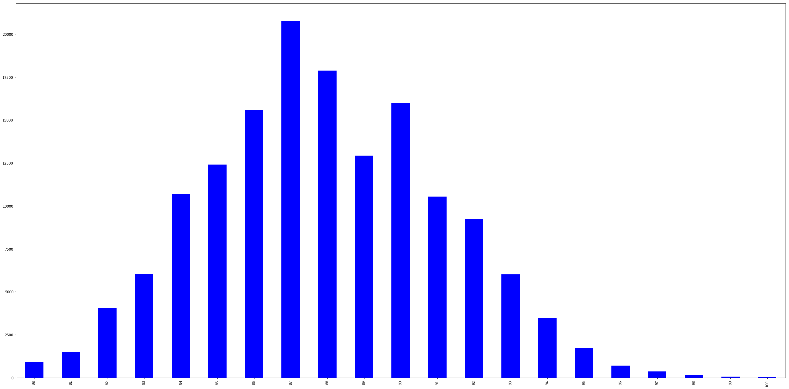


## Fontsize

* 图片变大之后，坐标轴的大小不合适


```python
reviews['points'].value_counts().sort_index().plot.bar(
    figsize=(40, 20), color='blue', fontsize=50)
```


    <matplotlib.axes._subplots.AxesSubplot at 0x11ad63c50>


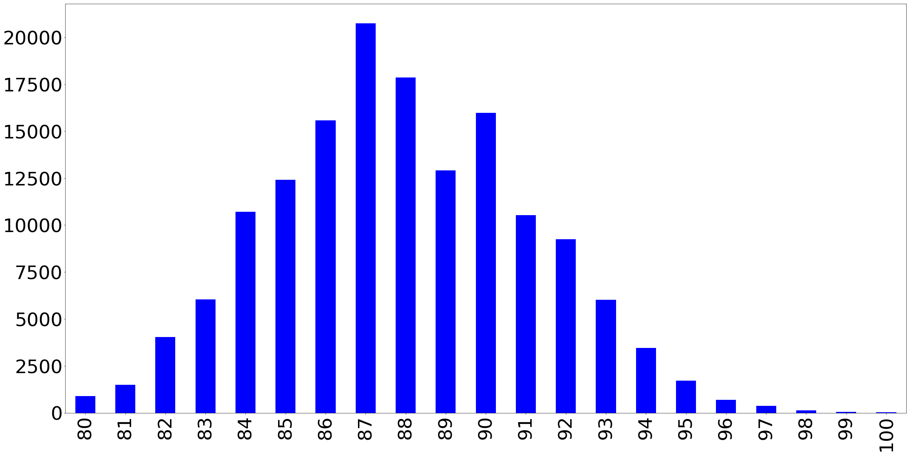


## Title 


```python
reviews['points'].value_counts().sort_index().plot.bar(
    figsize=(40, 20), 
    color='blue',
    fontsize=50, 
    title="ranking"
)
```


    <matplotlib.axes._subplots.AxesSubplot at 0x11c3dd668>


**但是我们发现 新加的 title 太小了**

* pandas 中 很难调节标题的大小

* 我们引入 matplotlib

**pandas 可视化工具是建立在其他的上面的，matplotlib 是 lower-level ,所以pandas 中的图都可以使用 matplotlib**


```python
ax = reviews['points'].value_counts().sort_index().plot.bar(
    figsize=(40, 20),
    color='blue',
    fontsize=50,
)
ax.set_title("Ranking", fontsize=50)
```


    Text(0.5,1,'Ranking')


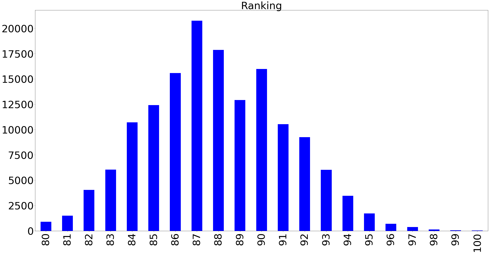


**seaborn 也是使用 matplotlib 作为底层**


```python
import seaborn as sns
ax = reviews['points'].value_counts().sort_index().plot.bar(
    figsize=(40, 20),
    color='blue',
    fontsize=50,
)
ax.set_title("Ranking", fontsize=50)
sns.despine(bottom= True,left= True)
# 默认移除 上面和右面的网格线条
```


# Subplots

* 基于 matplotlib

## Data


```python
reviews.head(2)
# 使用上面的评论数据
```


<div>
<style scoped>
    .dataframe tbody tr th:only-of-type {
        vertical-align: middle;
    }

    .dataframe tbody tr th {
        vertical-align: top;
    }

    .dataframe thead th {
        text-align: right;
    }
</style>
<table border="1" class="dataframe">
  <thead>
    <tr style="text-align: right;">
      <th></th>
      <th>country</th>
      <th>description</th>
      <th>designation</th>
      <th>points</th>
      <th>price</th>
      <th>province</th>
      <th>region_1</th>
      <th>region_2</th>
      <th>variety</th>
      <th>winery</th>
    </tr>
  </thead>
  <tbody>
    <tr>
      <th>0</th>
      <td>US</td>
      <td>This tremendous 100% varietal wine hails from ...</td>
      <td>Martha's Vineyard</td>
      <td>96</td>
      <td>235.0</td>
      <td>California</td>
      <td>Napa Valley</td>
      <td>Napa</td>
      <td>Cabernet Sauvignon</td>
      <td>Heitz</td>
    </tr>
    <tr>
      <th>1</th>
      <td>Spain</td>
      <td>Ripe aromas of fig, blackberry and cassis are ...</td>
      <td>Carodorum Selección Especial Reserva</td>
      <td>96</td>
      <td>110.0</td>
      <td>Northern Spain</td>
      <td>Toro</td>
      <td>NaN</td>
      <td>Tinta de Toro</td>
      <td>Bodega Carmen Rodríguez</td>
    </tr>
  </tbody>
</table>
</div>


```python
fig, axes = plt.subplots(2, 1, figsize=(12, 8))
# 创建一个 几行几列的 多子图
```


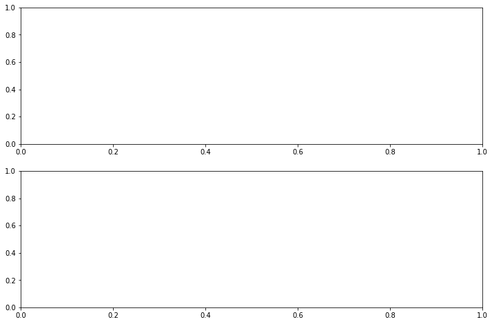


* subplots 返回两个值，一个是图形， 一个是 表示不同图形的多维数组


```python
axes
```


    array([<matplotlib.axes._subplots.AxesSubplot object at 0x11d17c668>,
           <matplotlib.axes._subplots.AxesSubplot object at 0x11d1bccc0>],
          dtype=object)


* 可以对 axes 进行数组索引，告诉图形我们在哪个子图上面绘图


```python
fig, axes = plt.subplots(2, 1, figsize=(12, 8))
# 创建一个 几行几列的 多子图
reviews['points'].value_counts().sort_index().plot.bar(
    ax=axes[0]
)

reviews['province'].value_counts().head(20).plot.bar(
    ax=axes[1]
)
```


    <matplotlib.axes._subplots.AxesSubplot at 0x11d874208>


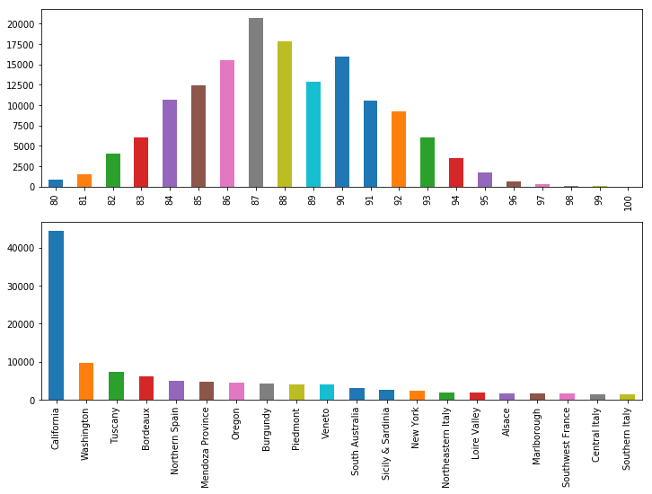


```python
fig, axarr = plt.subplots(2, 2, figsize=(12, 8))

reviews['points'].value_counts().sort_index().plot.bar(
    ax=axarr[0][0], fontsize=12, color='mediumvioletred'
)
axarr[0][0].set_title("Wine Scores", fontsize=18)

reviews['variety'].value_counts().head(20).plot.bar(
    ax=axarr[1][0], fontsize=12, color='mediumvioletred'
)
axarr[1][0].set_title("Wine Varieties", fontsize=18)

reviews['province'].value_counts().head(20).plot.bar(
    ax=axarr[1][1], fontsize=12, color='mediumvioletred'
)
axarr[1][1].set_title("Wine Origins", fontsize=18)

reviews['price'].value_counts().plot.hist(
    ax=axarr[0][1], fontsize=12, color='mediumvioletred'
)
axarr[0][1].set_title("Wine Prices", fontsize=18)

```


    Text(0.5,1,'Wine Prices')


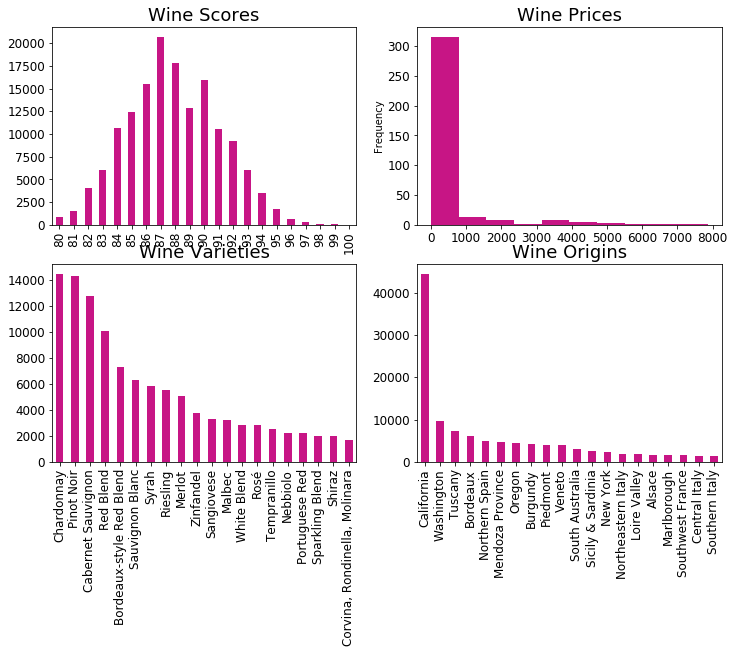


* 观察 我们呢画出的多子图 之间有重合的部分
* 我们需要调节图之间的间距


```python
fig, axarr = plt.subplots(2, 2, figsize=(12, 8))

reviews['points'].value_counts().sort_index().plot.bar(
    ax=axarr[0][0], fontsize=12, color='mediumvioletred'
)
axarr[0][0].set_title("Wine Scores", fontsize=18)

reviews['variety'].value_counts().head(20).plot.bar(
    ax=axarr[1][0], fontsize=12, color='mediumvioletred'
)
axarr[1][0].set_title("Wine Varieties", fontsize=18)

reviews['province'].value_counts().head(20).plot.bar(
    ax=axarr[1][1], fontsize=12, color='mediumvioletred'
)
axarr[1][1].set_title("Wine Origins", fontsize=18)

reviews['price'].value_counts().plot.hist(
    ax=axarr[0][1], fontsize=12, color='mediumvioletred'
)
axarr[0][1].set_title("Wine Prices", fontsize=18)

plt.subplots_adjust(hspace=.3)

#  wspace 和 hspace 控制 宽度和高度的百分比

import seaborn as sns
sns.despine()
```


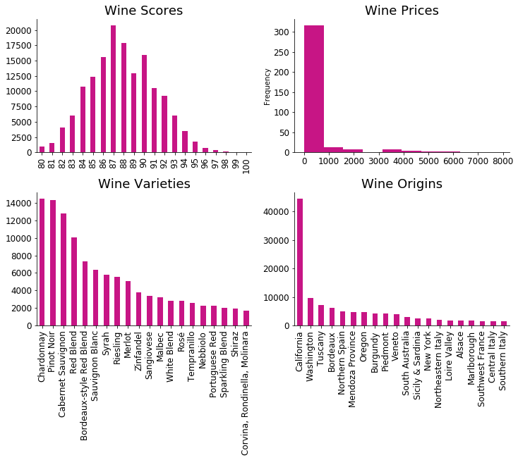


```python


```
