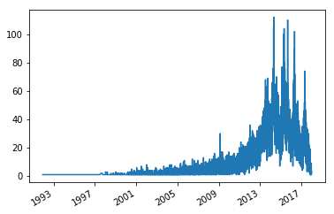
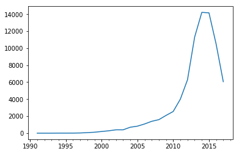
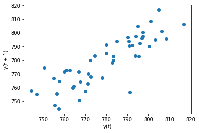
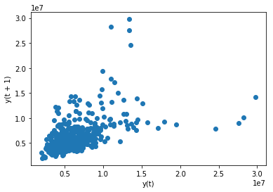
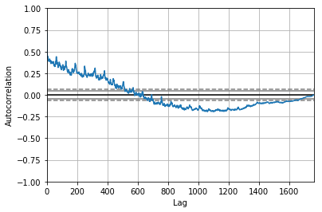

<h1>Table of Contents<span class="tocSkip"></span></h1>
<div class="toc"><ul class="toc-item"><li><span><a href="#Load-Data" data-toc-modified-id="Load-Data-1"><span class="toc-item-num">1&nbsp;&nbsp;</span>Load Data</a></span></li><li><span><a href="#Plot-Data" data-toc-modified-id="Plot-Data-2"><span class="toc-item-num">2&nbsp;&nbsp;</span>Plot Data</a></span><ul class="toc-item"><li><span><a href="#Line-Plot" data-toc-modified-id="Line-Plot-2.1"><span class="toc-item-num">2.1&nbsp;&nbsp;</span>Line Plot</a></span></li><li><span><a href="#Resampling" data-toc-modified-id="Resampling-2.2"><span class="toc-item-num">2.2&nbsp;&nbsp;</span>Resampling</a></span></li><li><span><a href="#Lag-plot" data-toc-modified-id="Lag-plot-2.3"><span class="toc-item-num">2.3&nbsp;&nbsp;</span>Lag plot</a></span></li><li><span><a href="#Autocorrelation-plot" data-toc-modified-id="Autocorrelation-plot-2.4"><span class="toc-item-num">2.4&nbsp;&nbsp;</span>Autocorrelation plot</a></span></li></ul></li></ul></div>

* 时间序列变量由特定于某个时间点的值填充。时间是线性的，并且是无限细粒度的，所以时间序列值实际上是区间变量的一种特殊情况。

* 原文link： https://www.kaggle.com/residentmario/time-series-plotting-optional/data


```python
import pandas as pd
import numpy as np
import matplotlib.pyplot as plt
%matplotlib inline

```

## Load Data

* 股票数据


```python
stocks = pd.read_csv("nyse/prices.csv", parse_dates=['date']) # 解析索引
stocks = stocks[stocks['symbol'] == "GOOG"].set_index('date') # Set the DataFrame index using existing columns.
stocks.head()
```


<div>
<style scoped>
    .dataframe tbody tr th:only-of-type {
        vertical-align: middle;
    }

    .dataframe tbody tr th {
        vertical-align: top;
    }

    .dataframe thead th {
        text-align: right;
    }
</style>
<table border="1" class="dataframe">
  <thead>
    <tr style="text-align: right;">
      <th></th>
      <th>symbol</th>
      <th>open</th>
      <th>close</th>
      <th>low</th>
      <th>high</th>
      <th>volume</th>
    </tr>
    <tr>
      <th>date</th>
      <th></th>
      <th></th>
      <th></th>
      <th></th>
      <th></th>
      <th></th>
    </tr>
  </thead>
  <tbody>
    <tr>
      <th>2010-01-04</th>
      <td>GOOG</td>
      <td>626.951088</td>
      <td>626.751061</td>
      <td>624.241073</td>
      <td>629.511067</td>
      <td>3927000.0</td>
    </tr>
    <tr>
      <th>2010-01-05</th>
      <td>GOOG</td>
      <td>627.181073</td>
      <td>623.991055</td>
      <td>621.541045</td>
      <td>627.841071</td>
      <td>6031900.0</td>
    </tr>
    <tr>
      <th>2010-01-06</th>
      <td>GOOG</td>
      <td>625.861078</td>
      <td>608.261023</td>
      <td>606.361042</td>
      <td>625.861078</td>
      <td>7987100.0</td>
    </tr>
    <tr>
      <th>2010-01-07</th>
      <td>GOOG</td>
      <td>609.401025</td>
      <td>594.101005</td>
      <td>592.651008</td>
      <td>610.001045</td>
      <td>12876600.0</td>
    </tr>
    <tr>
      <th>2010-01-08</th>
      <td>GOOG</td>
      <td>592.000997</td>
      <td>602.021036</td>
      <td>589.110988</td>
      <td>603.251034</td>
      <td>9483900.0</td>
    </tr>
  </tbody>
</table>
</div>


* animal shelter outcomes


```python
shelter_outcomes = pd.read_csv(
    "austin-animal-center-shelter-outcomes-and/aac_shelter_outcomes.csv", 
    parse_dates=['date_of_birth', 'datetime']
)
shelter_outcomes.head()
```


<div>
<style scoped>
    .dataframe tbody tr th:only-of-type {
        vertical-align: middle;
    }

    .dataframe tbody tr th {
        vertical-align: top;
    }

    .dataframe thead th {
        text-align: right;
    }
</style>
<table border="1" class="dataframe">
  <thead>
    <tr style="text-align: right;">
      <th></th>
      <th>age_upon_outcome</th>
      <th>animal_id</th>
      <th>animal_type</th>
      <th>breed</th>
      <th>color</th>
      <th>date_of_birth</th>
      <th>datetime</th>
      <th>monthyear</th>
      <th>name</th>
      <th>outcome_subtype</th>
      <th>outcome_type</th>
      <th>sex_upon_outcome</th>
    </tr>
  </thead>
  <tbody>
    <tr>
      <th>0</th>
      <td>2 weeks</td>
      <td>A684346</td>
      <td>Cat</td>
      <td>Domestic Shorthair Mix</td>
      <td>Orange Tabby</td>
      <td>2014-07-07</td>
      <td>2014-07-22 16:04:00</td>
      <td>2014-07-22T16:04:00</td>
      <td>NaN</td>
      <td>Partner</td>
      <td>Transfer</td>
      <td>Intact Male</td>
    </tr>
    <tr>
      <th>1</th>
      <td>1 year</td>
      <td>A666430</td>
      <td>Dog</td>
      <td>Beagle Mix</td>
      <td>White/Brown</td>
      <td>2012-11-06</td>
      <td>2013-11-07 11:47:00</td>
      <td>2013-11-07T11:47:00</td>
      <td>Lucy</td>
      <td>Partner</td>
      <td>Transfer</td>
      <td>Spayed Female</td>
    </tr>
    <tr>
      <th>2</th>
      <td>1 year</td>
      <td>A675708</td>
      <td>Dog</td>
      <td>Pit Bull</td>
      <td>Blue/White</td>
      <td>2013-03-31</td>
      <td>2014-06-03 14:20:00</td>
      <td>2014-06-03T14:20:00</td>
      <td>*Johnny</td>
      <td>NaN</td>
      <td>Adoption</td>
      <td>Neutered Male</td>
    </tr>
    <tr>
      <th>3</th>
      <td>9 years</td>
      <td>A680386</td>
      <td>Dog</td>
      <td>Miniature Schnauzer Mix</td>
      <td>White</td>
      <td>2005-06-02</td>
      <td>2014-06-15 15:50:00</td>
      <td>2014-06-15T15:50:00</td>
      <td>Monday</td>
      <td>Partner</td>
      <td>Transfer</td>
      <td>Neutered Male</td>
    </tr>
    <tr>
      <th>4</th>
      <td>5 months</td>
      <td>A683115</td>
      <td>Other</td>
      <td>Bat Mix</td>
      <td>Brown</td>
      <td>2014-01-07</td>
      <td>2014-07-07 14:04:00</td>
      <td>2014-07-07T14:04:00</td>
      <td>NaN</td>
      <td>Rabies Risk</td>
      <td>Euthanasia</td>
      <td>Unknown</td>
    </tr>
  </tbody>
</table>
</div>


## Plot Data

### Line Plot


```python
shelter_outcomes['date_of_birth'].value_counts().sort_values().plot.line()
```


    <matplotlib.axes._subplots.AxesSubplot at 0x1156bec88>





* 2015 年 动物出生的较多

### Resampling 
* 目前的数据是时间刻度是 day，我们修改为 year


```python
shelter_outcomes['date_of_birth'].value_counts().resample('Y').sum().plot.line()
```


    <matplotlib.axes._subplots.AxesSubplot at 0x114b43390>





* 注意到 pandas 正在自动调整x轴上的标签以匹配我们的输出类型。
这是因为Pandas具有“时间意识”;
当我们有相隔一年的数据点时，我们只想看到标签上的年份，而不是其他!

### Lag plot

* 数据点和数据集中的前一个点进行比较

* 参考： https://www.statisticshowto.datasciencecentral.com/lag-plot/

Lag plots allow you to check for:

* Model suitability.
* Outliers (data points with extremely high or low values).
* Randomness (data without a pattern).
* Serial correlation (where error terms in a time series transfer from one period to another).
* Seasonality (periodic fluctuations in time series data that happens at regular periods).


```python
from pandas.plotting import lag_plot

lag_plot(stocks['open'].tail(50))
```


    <matplotlib.axes._subplots.AxesSubplot at 0x115508128>





* 790 附近就存在一个异常的点

* 数据近似线性，说明不是随机的

* 数据显示线性模式，则表明存在自相关。正线性趋势(即从左到右向上)表明正自相关;负线性趋势(从左到右向下)暗示负自相关。数据在对角线上聚集得越紧密，自相关性越强;完全自相关的数据将聚集在一条对角线上。


```python
lag_plot(stocks['volume'].head(500))
```


    <matplotlib.axes._subplots.AxesSubplot at 0x115a99ba8>





### Autocorrelation plot 

* 自相关系数, 就是用来表达一组数据前后数据 (自己和自己) 的相关性的
默认是 和后一位


```python
from pandas.plotting import autocorrelation_plot

autocorrelation_plot(stocks['volume'])
```


    <matplotlib.axes._subplots.AxesSubplot at 0x115b61a90>




